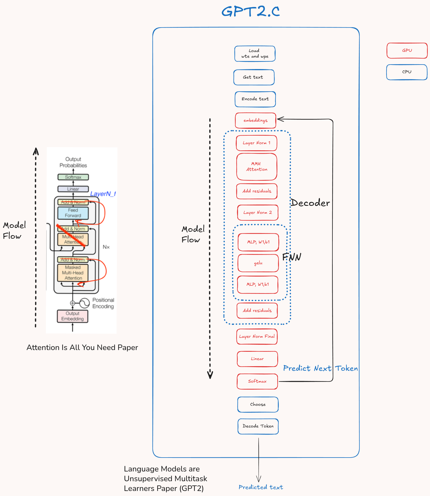
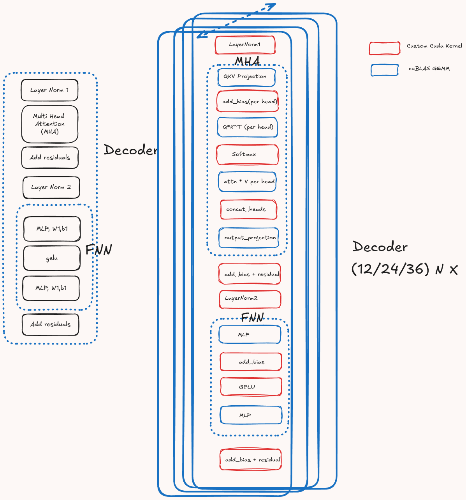
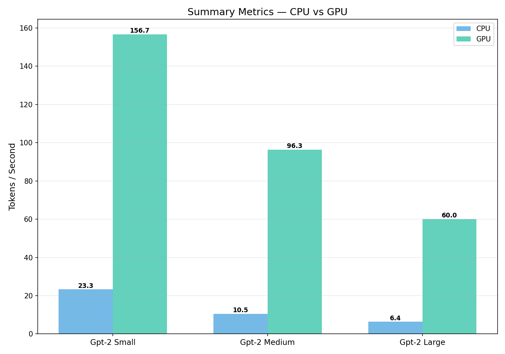
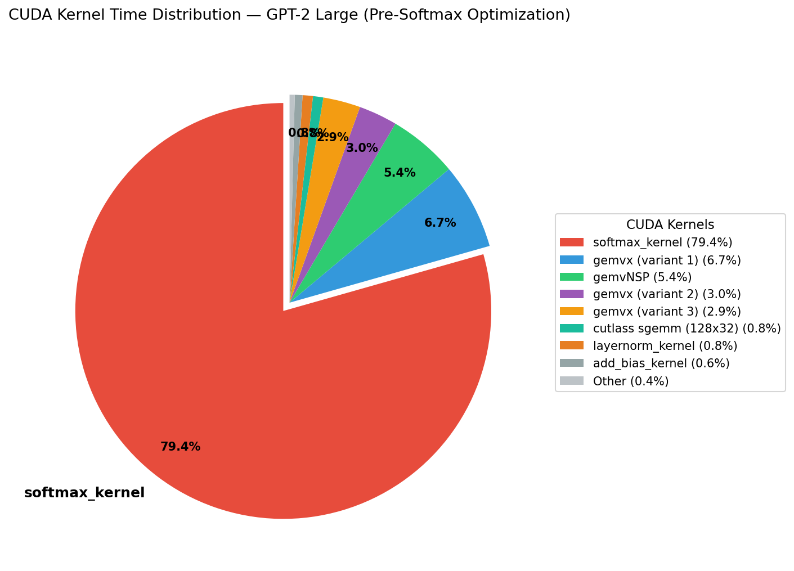
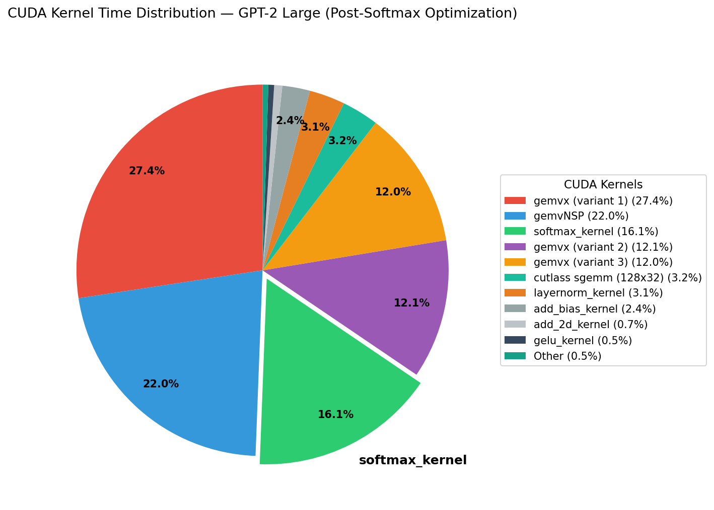
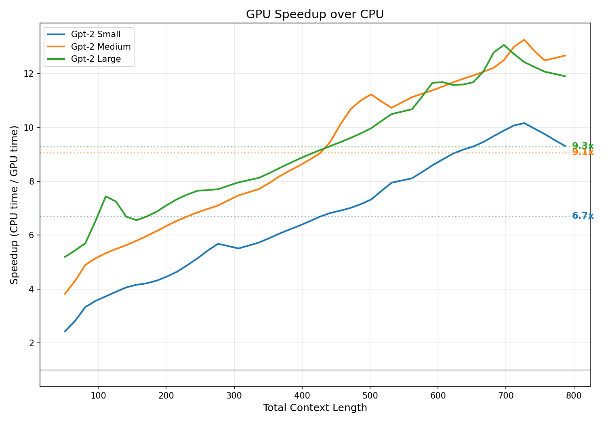
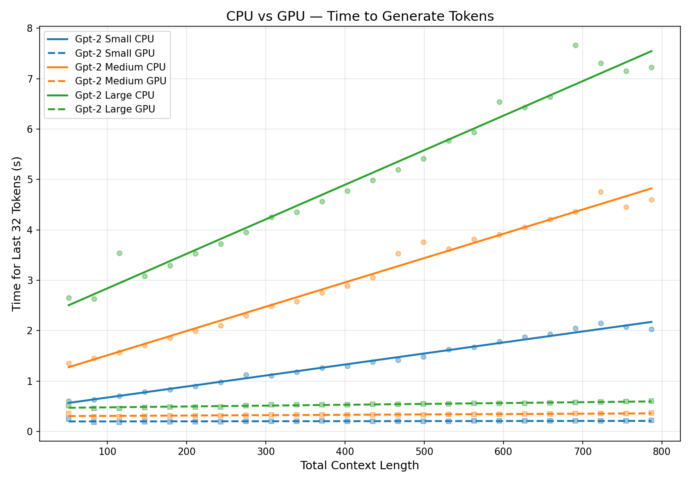
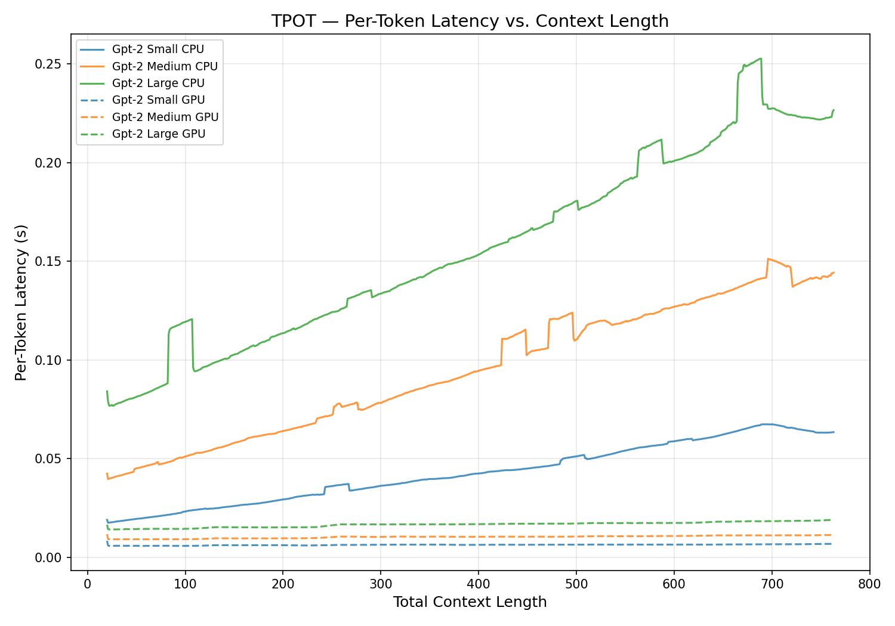

# GPT-2 in C — now on GPU with 9× faster inference

_The third article in the series: from CPU baseline, to CPU with KV cache, to GPU._

## Intro

In the previous articles I built GPT-2 inference from scratch in C — first an unoptimized CPU implementation, then a KV-cache version that gave it 10× faster generation. This article picks up the next step: moving the entire pipeline to GPU and seeing how much further it can go. Spoiler: another 9× on top.

<!-- TODO: Add a button to the GitHub code -->

## Reminder

OpenAI released GPT-2 weights in stages through 2019: Feb 2019 (124M), May 2019 (355M), Aug 2019 (774M), and Nov 2019 (1.5B, full release). GPT-2 comes in four model sizes (varying `d_model` and number of decoder layers). The context window is 1024 tokens across all sizes.

Each model has a different number of (identical) decoder layers.

`d_model` is the embedding dimension — each token is represented as a vector of `d_model` floats (32 bits).

| Model  | Params | d_model | num_layers |
|--------|--------|---------|------------|
| Small  | 124M   | 768     | 12         |
| Medium | 355M   | 1024    | 24         |
| Large  | 774M   | 1280    | 36         |
| XLarge | 1.5B   | 1600    | _(not supported in my code)_ |

---

## From CPU to GPU

All heavy tensor ops run on GPU; the text-to-token encode/decode and the final token selection (argmax / sampling) remain on CPU. The vocab-wide softmax still runs on GPU — only the selected token id gets copied back.

The building blocks which moved to GPU are shown in the diagram below.



Matrix multiplication was done with cuBLAS and the rest with 8 CUDA kernels (defined in `cuda_kernels.h`).

<!-- TODO: make sense to go over kernel by kernel and explain actual implementation? not sure about this one? -->
<!-- TODO: add the link to the article for matrix mul using BLAS and cuBLAS -->

Here is the decoder architecture to code-operation mapping.



### Where do the bytes go?

During generation, total VRAM bytes moved per step is dominated by **two pools**:

1. **Static weights** — every layer reads its GEMM weight matrices once per token.
2. **KV cache** — read by every attention head every step; grows linearly with context length.

Activations (the 1-row hidden state, 1-row Q/K/V, attention scores) are kilobytes per step — negligible.

#### What the code reads per generation step (per layer)

From `gpt2.c`, each transformer layer has these weight matrices (verified against the loader and the `dot_2d` calls in the decoder layers):

| Weight                       | Shape                  | Floats        |
|------------------------------|------------------------|---------------|
| `W_q`                        | `d_model × d_model`    | `d_model²`    |
| `W_k`                        | `d_model × d_model`    | `d_model²`    |
| `W_v`                        | `d_model × d_model`    | `d_model²`    |
| `attn_proj_weight`           | `d_model × d_model`    | `d_model²`    |
| `W1` (MLP up, c_fc)          | `d_model × 4·d_model`  | `4·d_model²`  |
| `W2` (MLP down, c_proj)      | `4·d_model × d_model`  | `4·d_model²`  |

Note: QKV are **not packed** in this code — the HuggingFace `c_attn.weight` is split at load time into three separate `d_model × d_model` matrices. Total bytes are the same either way.

```
Per-layer GEMM weight floats   = 1 + 1 + 1 + 1 + 4 + 4 = 12 × d_model²
Per-layer GEMM weight bytes    = 48 × d_model²        (FP32)
```

Plus, **once per token (after the layer loop):**

```
LM head weight = wte_T  :  d_model × vocab_size       (vocab_size = 50257)
```

Biases, LN γ/β, and the embedding gather are all in the kilobyte range — negligible.

#### Exact numbers per model

```
Per-token bytes = n_layers × 48 × d_model² + d_model × 50257 × 4
```

| Model  | d_model | n_layers | Per-layer | × n_layers | + LM head | **Total/token** |
|--------|---------|----------|-----------|------------|-----------|-----------------|
| Small  | 768     | 12       | 27 MiB    | 324 MiB    | 147 MiB   | **471 MiB**     |
| Medium | 1024    | 24       | 48 MiB    | 1152 MiB   | 196 MiB   | **1.32 GiB**    |
| Large  | 1280    | 36       | 75 MiB    | 2700 MiB   | 245 MiB   | **2.88 GiB**    |

#### Sanity check against the .bin file size

The bin file should equal: `wte` (read via gather only) + `wpe` + per-layer weights × `n_layers` + `ln_f` + the duplicated `lm_head` copy.

| Model  | per-layer × n_layers | + LM head (wte_T) | + wte (gather) | + wpe + LN | ≈ file size | actual file |
|--------|----------------------|-------------------|----------------|------------|-------------|-------------|
| Small  | 324 MiB              | 147 MiB           | 147 MiB        | ~3 MiB     | ~621 MiB    | 622 MiB ✓   |
| Medium | 1152 MiB             | 196 MiB           | 196 MiB        | ~4 MiB     | ~1548 MiB   | 1550 MiB ✓  |
| Large  | 2700 MiB             | 245 MiB           | 245 MiB        | ~5 MiB     | ~3196 MiB   | 3198 MiB ✓  |

Numbers match the on-disk sizes within a couple of MiB. Notice the `wte` matrix shows up **twice** in the file — once as the input embedding table, once as the LM head. They're tied in HuggingFace, but my weight serializer writes both copies — an open optimization for a future article (deduplicating saves 150–260 MiB per model).

#### Theoretical max vs measured

Divided by the RTX 5080's ~960 GB/s peak bandwidth, the theoretical maximum TPS purely from weight bandwidth would be:

| Model  | Per-token bytes | Theoretical max TPS | Measured TPS | Utilization |
|--------|-----------------|---------------------|--------------|-------------|
| Small  | 471 MiB         | ~2040               | 158          | ~7.7%       |
| Medium | 1.32 GiB        | ~727                | 95           | ~13%        |
| Large  | 2.88 GiB        | ~333                | 60           | ~18%        |

Three things eat the gap to peak:

1. **GEMV inefficiency** — `1 × d_model` queries don't keep tensor cores fed; cuBLAS falls back to `gemv*` kernels with low arithmetic intensity.
2. **KV-cache reads** — extra bandwidth not counted in the table above, growing with context length.
3. **Custom kernels + launch overhead** — the nsys profile (below) shows ~23% non-cuBLAS time. The standard mitigation here is **kernel fusion** — combining back-to-back small kernels like `add_bias` + `gelu` into a single launch — which cuts both the per-launch fixed cost and the round-trip through VRAM. Out of scope for this article but a clear next-step direction.

Notice that utilization **rises** as the model gets bigger — launch overhead and small-kernel fixed costs become a smaller fraction of the per-token work. That's why future weight-quantization work will give the biggest *absolute* TPS lift on Large, even though the *factor* should be roughly the same across sizes.

---

## CUDA Kernels

Most of the CUDA kernels were implemented and tested as unit modules and results were verified against the CPU implementation. Once verification passed, I integrated those modules in the main GPT-2 code.

The CUDA kernels below are organized from simple to complex. For learning purposes, I implemented the simpler kernels myself and asked Claude Code for feedback without showing my code, then fixed my bugs based on the feedback. For the more complex kernels, Claude Code was the main driver.

### Element-wise kernels (`add_2d`, `add_bias`, `gelu`)

Three kernels with the same parallel pattern: one thread per element, 2D grid mapping threads to rows and columns, no thread cooperation, no shared memory, no reductions. They differ only in the math:

- `add_2d` — `out[i] = a[i] + b[i]`
- `add_bias` — broadcasts a 1D bias vector across rows: `a[row][col] += b[col]`
- `gelu` — applies the GELU activation: `0.5 * x * (1 + tanh(0.797.. * (x + 0.044715 * x^3)))`

Pure embarrassingly parallel — the complexity is in the arithmetic (for `gelu`), not the parallelism.

### causal_masking — Row-wise fill

One thread per row (1D grid). Each thread writes `-INFINITY` to all positions above the diagonal: `row[j] = -INF for j > i`. Simple logic, but unlike the previous kernels, each thread does variable work (row 0 masks almost everything, last row masks nothing).

### concat_heads — Data rearrangement

Reshapes multi-head attention output from `[heads][seq_len][head_dim]` to `[seq_len][heads * head_dim]`. One block per head, one thread per dimension within the head. The complexity is in the index math — translating between two different memory layouts — not in the computation.

### embeddings — Lookup + addition

Each thread computes one element of the embedding: `embeddings[row][col] = wte[token_id][col] + wpe[row][col]`. The interesting part is the indirect memory access — `token_id` is looked up from an array, making the `wte` access data-dependent (scatter/gather pattern). Also supports partial computation via `start_row` / `n_rows` for the KV cache optimization.

### layernorm — Cooperative reduction (2 passes)

First kernel requiring **thread cooperation via shared memory**. One block per row, threads within a block work together across 3 phases:

1. **Mean** — each thread sums a stride of the row, then tree reduction in shared memory to get total sum
2. **Variance** — same pattern: each thread computes partial sum of squared differences, tree reduction to get variance, thread 0 computes `rsqrtf`
3. **Normalize** — each thread applies `(x - mean) * inv_std * gamma + beta`

Uses `__syncthreads()` barriers between phases. Two full tree reductions make this significantly more complex than the element-wise kernels.

### softmax — Cooperative reduction (3 passes)

The most complex kernel, and the one that was the performance bottleneck (79% of GPU time before rewrite). Same cooperative pattern as `layernorm` but with **3 reduction phases**:

1. **Find max** — tree reduction to find row maximum (for numerical stability)
2. **Sum exponentials** — compute `exp(x * inv_temp - max)` per element, tree reduction to get total sum
3. **Normalize** — divide each exponential by the sum

Also handles temperature scaling (`inv_temp`), stride (for non-contiguous rows in the attention matrix), and stores intermediate exponentials to avoid recomputation.

The rewrite from 1-thread-per-row to 1-block-per-row with shared-memory tree reduction was the single biggest optimization. The original version was effectively **compute-bound on a single thread** — one thread serially looping over up to 1024 columns while the rest of the GPU sat idle. The new version turns that serial bottleneck into a **parallel memory-bound** operation: 256 threads cooperate via shared-memory tree reductions, and the kernel becomes limited by how fast it can read the attention row from VRAM rather than by any single thread's serial work.

### Block configurations

Each kernel launches with a block size tuned to its parallelism pattern. Element-wise kernels use a 2D block (one thread per element); cooperative kernels use a 1D block sized to match the row width they reduce over.

| Kernel           | Block size | Threads/block |
|------------------|------------|---------------|
| `add_2d`         | (16, 16)   | 256           |
| `add_bias`       | (16, 16)   | 256           |
| `gelu`           | (32, 32)   | 1024          |
| `causal_masking` | (256, 1)   | 256           |
| `concat_heads`   | (64, 1)    | 64            |
| `embeddings`     | (16, 16)   | 256           |
| `layernorm`      | (1024, 1)  | 1024          |
| `softmax`        | (256, 1)   | 256           |

---

## Performance

Below is the throughput graph (Tokens/sec) per each model size.



Throughput improvements were achieved after applying different optimizations gradually. To name them:

- **Embeddings** — only embed new tokens (skip already-processed positions)
- **LayerNorm 1** — only normalize new rows via `cache_start_index`
- **Final LayerNorm + logits** — only process the last token position (instead of full sequence)
- **Removed `cudaDeviceSynchronize` from the token-generation hot path** — relies on `cudaMemcpy D2H` as implicit sync (eliminated unnecessary GPU stalls; setup/initialization syncs remain)
- **Softmax kernel rewrite** — reworked from 1-thread-per-row to 1-block-per-row with shared-memory tree reduction. Softmax kernel time dropped from 79% of GPU time to roughly 15%, giving a **2.8× overall speedup** on the Small model. See the before/after profiles below.

**Tokens/Second performance progression** (Small model, RTX 5080, FP32):

```
47.4  →  50.5  →  51.4  →  57.6  →  159.6 TPS
```

<!-- TODO: confirm which optimization corresponds to which TPS value (5 numbers, 5 optimizations — need to clarify the baseline / order) -->

### Profiling: where the time was going

To understand the GPU-side bottlenecks I used **NVIDIA Nsight Systems (`nsys`)**:

```bash
nsys profile --stats=true -o <output> ./out/gpu/gpt2_large \
    --prompt "..." \
    --req_out_tokens 768 --token_chunk_size 16 --no-stream --verbose
```

#### Before the softmax rewrite — Large model (~29.3s total GPU time)

```
 Time (%)  Total Time (ns)  Instances  Avg (ns)   Med (ns)   Min (ns)  Max (ns)   StdDev (ns)  Name
 --------  ---------------  ---------  ---------  ---------  --------  ---------  -----------  --------------------------------------------------
     79.4   23,282,099,690    553,728   42,046.1   33,217.0     2,528  7,619,356    235,598.8  softmax_kernel
      6.7    1,965,758,050    138,060   14,238.4    9,664.0     9,056    334,210      9,330.6  internal::gemvx::kernel (cuBLAS)
      5.4    1,584,634,427    552,240    2,869.5    2,848.0     1,312      5,184        815.1  gemvNSP_kernel (cuBLAS)
      3.0      873,046,662    552,240    1,580.9    1,568.0     1,440      2,304         83.9  internal::gemvx::kernel (cuBLAS)
      2.9      863,105,675     27,612   31,258.4   31,200.0    30,464    219,777      1,182.3  internal::gemvx::kernel (cuBLAS)
      0.8      228,423,069        768  297,425.9  296,738.0   292,834    502,020     10,139.4  cutlass_80_simt_sgemm_128x32_8x5_nn_align1
      0.8      224,069,627     56,064    3,996.7    4,000.0     3,808      4,384         64.9  layernorm_kernel
      0.6      170,684,875    165,888    1,028.9    1,024.0       960      1,824         52.3  add_bias_kernel
      0.2       47,813,803     55,296      864.7      864.0       800      1,728         22.2  add_2d_kernel
      0.1       37,266,545     27,648    1,347.9    1,344.0     1,312      1,536         14.5  gelu_kernel
      0.1       23,600,405     28,296      834.1      832.0       800      1,952         14.3  concat_heads_kernel
      0.0        6,547,136        900    7,274.6    2,656.0     2,624     55,328     11,254.5  cutlass_80_simt_sgemm_64x64_8x5_tn_align1
      0.0        2,074,893      1,620    1,280.8    1,248.0     1,152      2,176        204.0  cublasLt::splitKreduce_kernel
      0.0        1,737,005         36   48,250.1   48,257.0    47,393     49,185        421.5  cutlass_80_simt_sgemm_128x32_8x5_tn_align1
      0.0        1,342,507        720    1,864.6    1,856.0     1,824      2,176         37.3  cutlass_80_simt_sgemm_64x64_8x5_nn_align1
      0.0        1,010,724        768    1,316.0    1,312.0     1,184      1,856         62.8  embedding_kernel
      0.0          706,308        720      981.0      992.0       960      1,025         17.6  causal_masking_kernel
```



A single kernel — `softmax_kernel` — was eating **79.4%** of GPU time. The original implementation used one thread per row, serially looping over up to 1024 columns, leaving almost the entire GPU idle. That's what motivated the rewrite.

#### After the softmax rewrite — Large model (~7.2s total GPU time)

```
 Time (%)  Total Time (ns)  Instances  Avg (ns)   Med (ns)   Min (ns)  Max (ns)   StdDev (ns)  Name
 --------  ---------------  ---------  ---------  ---------  --------  ---------  -----------  --------------------------------------------------
     27.4    1,969,049,286    138,060   14,262.3    9,664.0     9,056    796,390      9,899.0  internal::gemvx::kernel (cuBLAS)
     22.0    1,578,857,781    552,240    2,859.0    2,816.0     1,312      5,408        811.1  gemvNSP_kernel (cuBLAS)
     16.1    1,158,308,768    553,728    2,091.8    1,952.0     1,664     95,328      3,336.4  softmax_kernel
     12.1      872,345,260    552,240    1,579.6    1,568.0     1,440      2,848         81.1  internal::gemvx::kernel (cuBLAS)
     12.0      863,347,842     27,612   31,267.1   31,200.0    30,432    235,586      2,107.6  internal::gemvx::kernel (cuBLAS)
      3.2      227,938,493        768  296,794.9  296,610.0   293,058    308,706      1,800.7  cutlass_80_simt_sgemm_128x32_8x5_nn_align1
      3.1      223,941,294     56,064    3,994.4    3,969.0     3,744      4,384         62.3  layernorm_kernel
      2.4      170,322,208    165,888    1,026.7    1,024.0       928      2,080         50.1  add_bias_kernel
      0.7       47,833,991     55,296      865.1      864.0       800      1,632         21.4  add_2d_kernel
      0.5       37,041,437     27,648    1,339.8    1,344.0     1,312      1,984         17.6  gelu_kernel
      0.3       23,790,016     28,296      840.8      832.0       800      2,208         17.7  concat_heads_kernel
      0.1        6,542,648        900    7,269.6    2,656.0     2,592     54,913     11,243.4  cutlass_80_simt_sgemm_64x64_8x5_tn_align1
      0.0        2,091,469      1,620    1,291.0    1,248.0     1,152      2,176        201.0  cublasLt::splitKreduce_kernel
      0.0        1,738,529         36   48,292.5   48,224.0    47,552     49,216        404.5  cutlass_80_simt_sgemm_128x32_8x5_tn_align1
      0.0        1,342,629        720    1,864.8    1,856.0     1,824      2,112         35.9  cutlass_80_simt_sgemm_64x64_8x5_nn_align1
      0.0        1,007,338        768    1,311.6    1,312.0     1,216      1,856         60.9  embedding_kernel
      0.0          715,493        720      993.7      992.0       960      1,024         15.5  causal_masking_kernel
```



Softmax dropped from **79.4% → 16.1%** of GPU time. cuBLAS GEMM kernels (`gemvx`, `gemvNSP`, `cutlass`) now make up roughly **77%** of GPU time — the picture you'd expect for a transformer, where matrix multiplications should be the dominant cost. Total GPU time on Large dropped from **~29.3s to ~7.2s — a 4× speedup from the softmax rewrite alone**.

### Speedup ratio



Large model peaks at **~13× speedup at long context, averaging 9.3× across context lengths**. The larger the model, the more the GPU benefits. This graph shows the ratio of CPU time to GPU time, and the bigger models see bigger relative improvements because CPU slows down much more than GPU as model size grows.

### Time for the last 32 tokens



This view shows the aggregate, chunked time to generate the next 32 tokens at increasing context lengths. CPU scales linearly; GPU stays **empirically near-flat over GPT-2's 1024-token context window** on this hardware. The attention work is still O(N) per token (each new query attends to all cached keys/values), but the GPU has enough cores to absorb that growth without measurable slowdown at this context size.

- **CPU lines grow linearly (O(N))** — all three models show clear linear growth. As context length increases, the time to generate the next 32 tokens increases proportionally. Even with KV cache (which makes the FFN, layernorm, and projections O(1) per token), the attention step remains O(N) — each new token must attend to all previous positions via Q·Kᵀ and attn·V multiplications that scale with sequence length. On CPU, this work runs sequentially, so every extra context position adds directly to wall-clock time.
- **GPU lines are flat (appears O(1))** — all three dashed lines stay nearly constant regardless of context length. The attention is still O(N) in theory, but the GPU parallelizes the work across thousands of CUDA cores. Within GPT-2's 1024-token window, there are always enough threads to absorb the growing sequence dimension without meaningful slowdown. At much longer context windows (2K–128K as in modern models), you would start seeing the linear growth on GPU too — and that's exactly why techniques like flash attention matter at scale.
- **The gap widens with context** — at context length 50, CPU and GPU are relatively close. By context 800, Large CPU takes ~7.5s vs ~0.6s on GPU. The GPU advantage compounds as context grows because CPU pays the O(N) cost linearly while GPU doesn't.
- **Larger models amplify the effect** — the CPU slopes get steeper with model size (Small < Medium < Large), because bigger models have more attention heads and larger dimensions, multiplying the O(N) cost. GPU lines also step up with model size, but remain flat.
- **GPU lines are tightly grouped** — the difference between Small, Medium, and Large on GPU is relatively small (~0.2s to ~0.6s), while on CPU the spread is massive (~2s to ~7.5s at context 800). The GPU absorbs the model size increase much more gracefully.

### Time per output token



Time per output token shows the raw per-token granularity. Noisier compared to the previous graph. You can notice the step pattern on the CPU and the lack of them in the GPU case.

### GPU Run (Large model, 768 generated tokens, 60 TPS)

<video src="assets/videos/gpu_run.mp4" controls width="720"></video>

[Download / open directly](assets/videos/gpu_run.mp4)

### CPU Run (Large model, 768 generated tokens, 6.4 TPS)

<video src="assets/videos/cpu_run.mp4" controls width="720"></video>

[Download / open directly](assets/videos/cpu_run.mp4)

---

## Verification

Outputs were verified against HuggingFace's reference implementation by sampling at temperature 0 (greedy decoding) and comparing token sequences. CPU and GPU paths produce identical token streams for matching prompts.

<!-- TODO: add concrete examples (sample prompts + generated text comparing CPU/GPU/HuggingFace) -->

---

## Next step

### Precision reduction: FP32 → FP16 / BF16

The current implementation runs everything in FP32. The "Where do the bytes go?" section showed that generation is **memory-bandwidth bound**: each generated token streams hundreds of megabytes of weights from VRAM. Halving the precision halves the bytes-per-token, so most of the speedup should fall out of bandwidth alone. On top of that, the RTX 5080's tensor cores deliver several times the throughput on FP16/BF16 GEMM versus FP32.

**FP16 vs BF16:**

- **FP16** (`__half`) — 5-bit exponent, 10-bit mantissa. Better precision than BF16 but a smaller exponent range; attention scores and the `exp()` inside softmax can overflow without care.
- **BF16** (`__nv_bfloat16`) — 8-bit exponent (same range as FP32), 7-bit mantissa. No overflow worries — what most modern LLM inference stacks pick. The 5080 supports it natively.

**What changes in the code:**

- Convert weight tensors to FP16/BF16 in `extract_weights.py`
- Switch cuBLAS GEMM calls from `cublasSgemm` to `cublasGemmEx` with `CUDA_R_16F` / `CUDA_R_16BF`
- Update the 8 custom kernels to use `__half` / `__nv_bfloat16`
- Keep softmax and layernorm **accumulators in FP32** for numerical stability

**Expected impact:**

- Weight file ~half the size: Small from 622 MiB → ~310 MiB, Large from 3198 MiB → ~1600 MiB
- KV cache footprint halved
- Conservative estimate: **1.5–2× generation TPS** on top of the current numbers, with the bigger relative win on Large since it's the most bandwidth-bound

### Quantization

Beyond FP16/BF16 there's a clear next step: quantizing weights to INT8 or INT4 while keeping activations in FP16. In a bandwidth-bound regime, smaller weights translate almost directly to faster generation, and modern weight-only quantization techniques (GPTQ, AWQ) lose almost no quality at 4 bits. Topic for a future article.

---

## See also

- [Building GPT-2 in C — now with KV-Cache and 10x faster inference](https://rbenhayun.substack.com/p/building-gpt-2-small-in-c-a-from)
- [cuBLAS vs OpenBLAS: Benchmarking Matrix Multiply for GPT-2](https://rbenhayun.substack.com/p/2d-dot-product-using-gpu-and-cpu)
- Code: [github.com/roeybenhayun/c_gpt2](https://github.com/roeybenhayun/c_gpt2)
