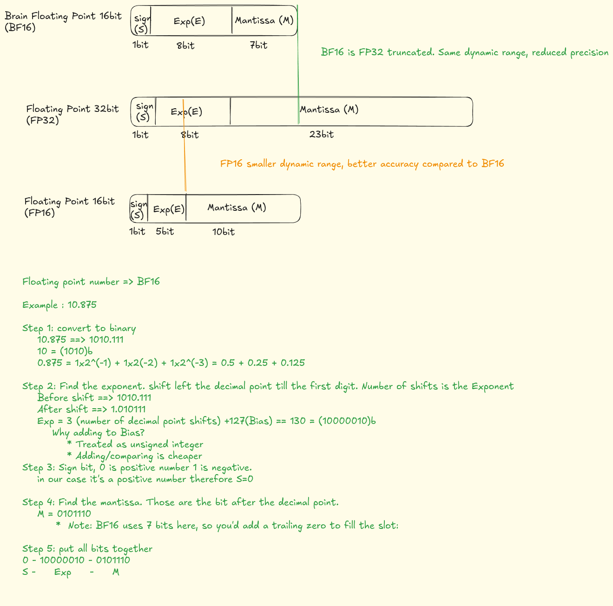
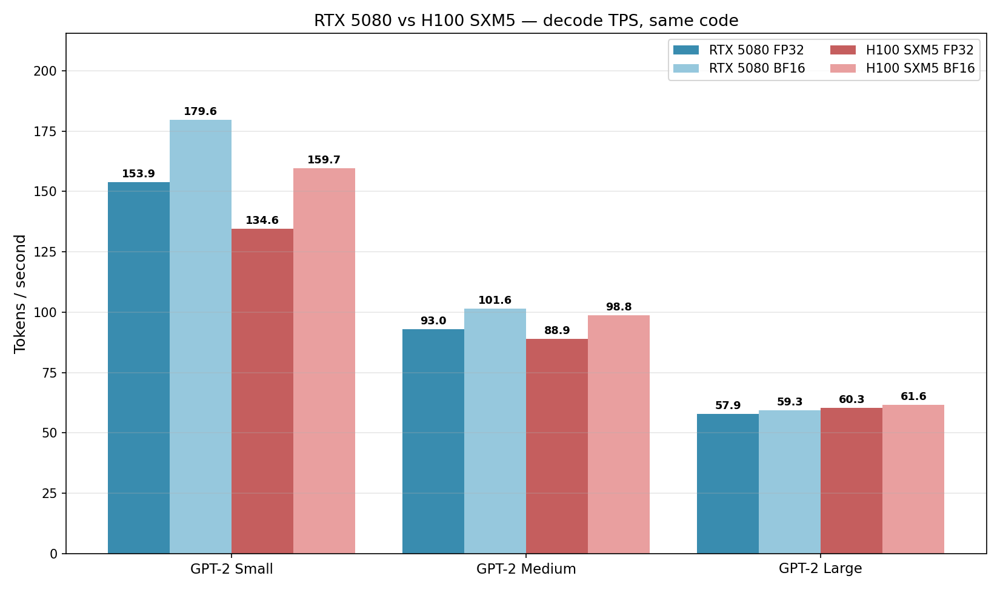
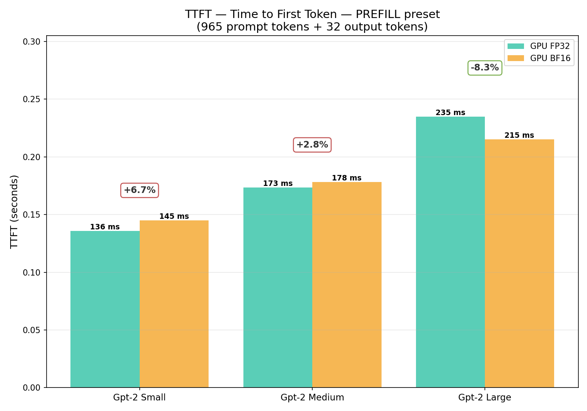

# GPT-2 in C — FP32 to BF16 on GPU

_The fourth article in the series: from CPU baseline, to CPU with KV cache, to GPU, to BF16 — measured on a local RTX 5080 (consumer Blackwell) and cross-checked on a Lambda.ai H100 GPU(Hopper)._

## Intro

In the previous article I moved GPT-2 inference from CPU to GPU and ended with three FP32 numbers on an RTX 5080: **158 / 95 / 60 TPS** for Small / Medium / Large. The bandwidth analysis in that article pointed at the obvious next step: drop precision from FP32 to BF16, halve the bytes per generated token, get most of a 2× speedup back from bandwidth alone.

Spoiler: it's more complicated than that. The implementation worked end-to-end, the model produces fluent BF16 output, and on GPU the build matrix grew to 9 binaries (CPU FP32 + GPU FP32 + GPU BF16 across three model sizes). But the throughput improvement on Large turned out to be **~0%** — and the reasons are more interesting than the speedup would have been.

### How this article is organized

- **Setup** — quick reminders (previous article, FP32/BF16/FP16, Amdahl) and what changed in the code.
- **Decode results & investigation** — the headline TPS numbers, why BF16 didn't help on Large, the mask-kernel bug found while testing the prefill hypothesis, and the fix.
- **Prefill results** — formal TTFT numbers showing the *mirror image* of decode: BF16 win grows with model size.
- **Scoreboard & H100 cross-check** — before/after table, then the same code on a Lambda Cloud H100 confirming the bottleneck is host-side, not silicon.
- **Synthesis & next steps** — how a 15× peak-tensor-core ratio dilutes down to 1.30× wall-clock, lessons learned, and exploration paths from here.

## Reminder — what the previous article did

The third article moved GPT-2 inference from a pure-C CPU implementation to GPU. Matrix multiplications run on cuBLAS; the rest goes through 8 hand-written CUDA kernels (`embeddings`, `layernorm`, `softmax`, `add_2d`, `add_bias`, `casual_masking`, `concat_heads`, `gelu`). KV cache stayed enabled. Tokenization stayed on CPU via a Python local running service.

The endpoint was 60 TPS on Large with 768 generated tokens. Profiling showed cuBLAS GEMM kernels at ~77% of GPU time and `softmax_kernel` (post-rewrite) at ~16% — the shape you'd expect for a transformer where matmul should dominate.

Per-token weight bandwidth on Large in FP32 was 2.88 GiB. At RTX 5080's ~960 GB/s peak that bounds throughput at ~330 TPS. The measured 60 TPS sat at ~18% of that ceiling, so on paper there was room — and BF16 would shrink the per-token bandwidth by 2×, doubling the ceiling.

That's the version of the story the previous article ended on.

---

## Floating point format reminder



The three formats this article touches, side by side at the bit level. The takeaway for inference: **BF16 keeps FP32's full 8-bit exponent (so the dynamic range is identical) and only sacrifices mantissa precision** — that's why it's the safer half-precision choice for transformer weights and activations, which span many orders of magnitude. FP16's 5-bit exponent gives more mantissa bits but is much more prone to overflow/underflow without loss-scaling tricks. In this codebase, **reductions and accumulators stay FP32** regardless of storage dtype — and cuBLAS GEMMs use BF16 inputs with an FP32 accumulator (`CUBLAS_COMPUTE_32F`). So the storage choice affects two things: bytes per element streamed from VRAM, and which cuBLAS algorithm gets picked (FP32 inputs → CUDA-core path; BF16 inputs → tensor-core path).

**Why BF16 specifically, and not FP16?** This is what the industry has converged on. Llama 3, Mistral, and DeepSeek-V3 all ship their weights in BF16; vLLM's auto-precision logic picks BF16 for BF16-trained models (and most post-2023 LLMs are BF16-trained); TensorRT-LLM treats BF16 as a first-class precision alongside FP8/INT8 quantization. The reason is exactly the dynamic-range argument above — BF16's FP32-equivalent exponent range avoids the underflow/overflow issues that plague FP16 during training, and that "trained in BF16" carries through to BF16 being the natural inference dtype as well. FP16 was the dominant half-precision format pre-Ampere when BF16 hardware support didn't exist; on modern Blackwell/Hopper silicon both formats run on the same tensor cores at the same throughput, so the historical FP16 advantage has evaporated. (For the curious: we did run FP16 on this codebase as a side experiment — performance is within ±5% of BF16 across all sizes and presets, with no precision-related failures observed. We focus on BF16 here because it's the format anyone would actually choose for a new inference deployment.)

---

## Amdahl's law — a quick primer

Amdahl's law gets referenced several times below. If you're not familiar with it, here's the one-paragraph version.

Amdahl's law says that **the speedup you get from optimizing part of a program is bounded by the fraction of time that part takes**. If 50% of your runtime is in some component X and you make X infinitely fast, the total runtime only halves — so the maximum total speedup is 2×, not infinite. The formula:

```
                       1
speedup  =  ─────────────────────────
                (1 − p) + p / s
```

where `p` is the fraction of original time spent in the part you're optimizing, and `s` is the speedup of just that part.

The practical takeaway: **once you've shrunk one bottleneck, the next biggest one becomes the new ceiling**. Two examples that come up repeatedly in this article:

- **Kernel-level**: cuBLAS GEMM is 62% of GPU kernel time, and BF16 makes the GEMM 3.3× faster on Large prefill. The overall *kernel* speedup is `1 / (0.38 + 0.62/3.3) ≈ 1.8×` — not 3.3×. The non-GEMM kernels (which BF16 doesn't touch) become the new ceiling.
- **End-to-end**: host overhead is ~50% of decode wall clock, so the GPU portion is the other 50% (`p = 0.5`). Even with an infinitely fast GPU (`s → ∞`), total wall-clock speedup is `1 / (0.5 + 0.5/∞) = 1 / 0.5 = 2×`. On this workload as currently structured, no GPU upgrade alone can exceed that bound — closing the gap requires changing the execution shape (CUDA Graphs, async tokenizer, etc.) to shrink the host portion.

Every time the article says something is "the binding constraint", "the ceiling", or "Amdahl-bound", it's pointing at this same idea.

---

## What changed in the code

Three places needed updates: the build system, the host-side C, and the CUDA kernels. The shape of every change is "make the storage dtype a build-time switch, keep math in FP32."

### Makefile

Two new phony targets — `bf16` and `fp16` — that inject `-DUSE_BF16` or `-DUSE_FP16` into both `gcc` and `nvcc` invocations. The default (no flag) stays FP32 and is behaviorally comparable to the previous article (the GEMM call did move from `cublasSgemm` to `cublasGemmEx` with `CUBLAS_COMPUTE_32F`, but compute, accumulator, and storage are all still FP32). Output directories are split per dtype (`out/gpu/`, `out/gpu/bf16/`, `out/gpu/fp16/`) so a stale FP32 `.o` can't accidentally link into a BF16 host binary.

```
make gpu small               # FP32 (default)
make gpu bf16 small          # BF16
make gpu fp16 small          # FP16
```

A guard in the Makefile rejects `bf16` / `fp16` without `gpu`, since OpenBLAS has no half-precision GEMM and the CPU path would silently miscompile.

### Host-side C (`gpt2.c`)

A pair of typedefs in `model_config.h`:

```c
#if defined(USE_BF16)
    typedef __nv_bfloat16 act_t;     // for nvcc
    typedef __nv_bfloat16 weight_t;
    // ...host side uses __bf16
#elif defined(USE_FP16)
    typedef __half act_t;
    typedef __half weight_t;
#else
    typedef float act_t;
    typedef float weight_t;
#endif
```

`act_t` is for activation buffers (intermediate tensors flowing between layers); `weight_t` is for loaded model parameters. In FP32 builds both alias to `float` and the binary is unchanged. In BF16 they become 2-byte types.

Every `float`-typed buffer or pointer in the inference path was retyped to one of those two — about 320 sites across `gpt2.c` and the kernel headers. Scalar accumulators (mean, variance, softmax sum, GEMM α/β, temperature) stayed `float` so the math still happens in FP32. The GEMM call was swapped from `cublasSgemm` to `cublasGemmEx` with a build-time-selected `cudaDataType_t`:

```c
#if defined(USE_BF16)
    #define GEMM_DATA_TYPE CUDA_R_16BF
#elif defined(USE_FP16)
    #define GEMM_DATA_TYPE CUDA_R_16F
#else
    #define GEMM_DATA_TYPE CUDA_R_32F
#endif
```

The compute type stays `CUBLAS_COMPUTE_32F` in every build — FP32 accumulator regardless of input dtype.

### Loader

The on-disk format stays FP32 — there's no conversion of the `.bin` files. Instead, a new `fread_weights_or_exit` reads the file in 4 KB FP32 chunks and casts each element into the destination `weight_t` buffer:

```c
static void fread_weights_or_exit(weight_t *dest, size_t count, FILE *fp) {
#if defined(USE_BF16) || defined(USE_FP16)
    static float chunk[4096];
    while (count > 0) {
        size_t k = ...;
        fread(chunk, sizeof(float), k, fp);
        for (size_t i = 0; i < k; i++) dest[i] = (weight_t)chunk[i];
        ...
    }
#else
    fread(dest, sizeof(weight_t), count, fp);  // identical to old behavior
#endif
}
```

Same `.bin` file works for any dtype build — picked because it keeps the weight pipeline dead simple and avoids forking weight files three ways.

### CUDA kernels

A pair of `__device__ __forceinline__` helpers — `to_float(act_t)` and `to_act(float)` — that compile to identity in FP32 and to a single `__bfloat162float` / `__float2bfloat16` instruction in BF16. Every load from a global tensor is wrapped in `to_float`, every store is wrapped in `to_act`. Reductions and the accumulators in between stay `float` so the math still happens in FP32 (cuBLAS GEMMs separately use BF16 inputs with FP32 accumulation, covered above):

```c
// before
output[row][i] = normalized * gamma[i] + beta[i];

// after
output[row][i] = to_act(normalized * to_float(gamma[i]) + to_float(beta[i]));
```

This pattern keeps numerical reductions (variance, exp sum) in FP32 — the only safe choice for any dtype narrower than FP32 — while letting the buffers themselves shrink to 2 bytes per element.

---

## Prefill vs decode

Generation has two phases that look very different to the GPU.

**Prefill** — the first forward pass over the input prompt. All `N` prompt tokens are processed at once. The QKV projection becomes an `N × d_model @ d_model × d_model` GEMM, with `M = N` rows. When `N` is large enough, this is a real matrix multiply — tensor cores engage, FLOPs are high, the GPU stays busy. When `N` is small, the GEMM behaves more like decode (more on this below).

**Decode** — every token after the first one. With KV cache enabled, only one new query needs to be projected per step, so `M = 1`. The GEMM becomes a vector × matrix product (a GEMV), which on cuBLAS dispatches to GEMV-shaped kernels that don't use tensor cores at all — they run on the regular FP32 ALUs.

The thing that determines whether BF16 helps is **`M` — the number of rows being multiplied**, not the phase name. Decode is always `M = 1`. Prefill is `M = N`, but on GPU there's a tile-size threshold below which cuBLAS still won't pick a tensor-core algorithm. That's the sweet-spot question and we'll measure it later in the article.

Two timings come out of the JSON log:

- **TTFT** (time to first token) — pure prefill cost. Dominated by `M = N` GEMMs.
- **TPOT** (mean time per output token) — pure decode cost. Dominated by `M = 1` GEMVs.

Output TPS as the user perceives it depends on which phase dominates. Three concrete shapes show that clearly:

| Shape | Prompt | Output | Phase mix | Real-world example |
|---|---|---|---|---|
| Prefill-dominated | 1000 tokens | 10 tokens | ~99% prefill | RAG / long-context summarization |
| Balanced | 200 tokens | 200 tokens | roughly 50/50 | Typical chat exchange |
| Decode-dominated | 10 tokens | 1000 tokens | ~99% decode | "Tell me a story…" / long generation |

A note on terminology: **prefill** and **decode** are completely standard in the inference-serving literature — the vLLM paper, NVIDIA TensorRT-LLM, and every major serving stack use them as the canonical phase names, almost always alongside **TTFT** for prefill latency and **TPOT** for per-decode-step latency. **Balanced**, on the other hand, is local naming for the (~200, ~200) ISL/OSL shape — the industry usually describes workloads by their input/output sequence lengths or by use case ("chat", "RAG", "code completion") rather than a single label. I'm using the three preset names here purely because they're convenient to type in `./scripts/run.sh --decode | --prefill | --balanced`.

Whether BF16 helps depends on which of these regimes you're in — and that's where the experiment got interesting.

---

## Results — decode across model sizes

In the decode regime, every step after the first uses the KV cache, so only one new query is projected per token. Every cuBLAS GEMM is **`M = 1`** — a vector × matrix product (GEMV), which on cuBLAS dispatches to GEMV-shaped kernels that **don't engage tensor cores at all** regardless of dtype. The BF16 lever here isn't compute, it's **memory bandwidth**: every GEMV reads its full weight tile from VRAM, so halving the dtype halves the bytes streamed per token.

### Default benchmark — same input as the previous article

First measurement: re-run the same harness used for the FP32 article (768 generated tokens after a short prompt — the decode-dominated shape) for both FP32 and BF16, all three model sizes.


| Model | FP32 TPS | BF16 TPS | Speedup |
|---|---|---|---|
| Small  | 153.9 | 179.6 | 1.17× |
| Medium |  93.0 | 101.6 | 1.09× |
| Large  |  57.9 |  59.3 | 1.02× |

This is the **opposite** of what the bandwidth analysis predicted. Larger models stream more weight bytes per token, so they should benefit *more* from halving the dtype, not less. Yet Small saw a 17% gain, Medium 9%, and Large essentially nothing.

### Per-token latency overlay


What's plotted: chunk wall time (~32 tokens per chunk) vs total context length, six lines total — three model sizes × two dtypes. The slope of each line is the per-token cost, and BF16 sits below FP32 for every model at every context length, with the gap widest on Small.

> **Note on "chunk":** `token_chunk_size` (default 32, set via `--token_chunk_size`) is purely a **JSON logging interval** — every 32 generated tokens, the decode loop writes a log entry with the elapsed wall time for those 32 tokens. It does **not** chunk the actual computation in any way. Each token is still produced by its own forward pass at M = 1; prefill is still one forward pass at M = N over the full prompt. The chunking only exists to keep the per-token-latency JSON arrays small enough to be useful when plotting.

### Speedup ratio over context length


What's plotted: the BF16-over-FP32 speedup ratio per model size, with dotted horizontal lines at the per-model mean. Three curve features are worth calling out:

- **Mean speedup shrinks with model size** — Small ~1.20×, Medium ~1.10×, Large ~1.03×. (The mirror image of the prefill picture, presented later in the article.)
- **A peak at short context (~100 tokens)** — pure GEMV territory, weight reads dominate, BF16 halves the bytes ⇒ ratio peaks.
- **A dip in the middle (~300–600), then a climb back up at long context (~700+)** — KV-cache reads grow linearly with context length, so at long context the BF16 win on the cache reads pulls the ratio back up.

### Why the BF16 win shrinks from Small to Large

At decode, all three sizes are at `M = 1`, so all three are below the tensor-core threshold. The win comes purely from bandwidth halving on the per-layer GEMV. But two effects scale **with model size** in a way that erodes that win on bigger models:

**1. More cuBLAS calls per token on bigger models.** Each transformer block issues 6 GEMVs (Q, K, V, O, FFN-up, FFN-down). Small has 12 layers → 72 calls per token. Large has 36 layers → 216 calls per token. Each call carries a **fixed CPU overhead** for cuBLAS heuristic dispatch and a **fixed GPU kernel-launch overhead** that is the same in BF16 as in FP32 (and a touch higher for `cublasGemmEx` than `cublasSgemm`). For Large, those 216 fixed-cost calls per token eat a much bigger absolute chunk of the per-token budget than the bandwidth saving can recover.

**2. cuBLAS picks worse algorithms in BF16 at `M = 1`.** As the next section's nsys investigation shows: at `M = 1` BF16 cuBLAS dispatched **+1060 ms of `gemvx`** and a brand-new **+319 ms of `splitKreduce`** compared to FP32 over a full 768-token run. That's pure dispatch overhead — bytes that didn't need to be reduced, kernels that didn't need to launch — and it scales with the number of calls. Large pays that overhead 3× more often than Small per token.

This decode-side trend (BF16 win shrinks from Small to Large) has a counterpart in the prefill regime that runs in the *opposite* direction (BF16 win grows from Small to Large). Both stories share the same root cause — the M dimension of the GEMM — and the next two sections walk through how that M-based explanation was found.

---

## Why didn't BF16 help on Large?

### First nsys investigation — the cuBLAS dispatch hypothesis

Profiling Large under both dtypes (default 768-token decode-heavy run) showed the cuBLAS GEMM time was *approximately the same* — but the kernel mix was completely different.

| Kernel family | FP32 (ms) | BF16 (ms) | Δ |
|---|---|---|---|
| `cublas gemvx` (all variants) | 3713 | 4773 | +1060 |
| `cublas gemvNSP` | 1591 | 246 | −1345 |
| `cublas splitKreduce` | 2 | 321 | +319 |
| `softmax_kernel` | 1156 | 1236 | +80 |
| `layernorm_kernel` | 224 | 206 | −18 |
| `add_bias_kernel` | 172 | 152 | −19 |
| **TOTAL kernel time** | **7208** | **7075** | **−133 (−1.8%)** |

Two things stood out:

1. **No tensor cores.** The BF16 profile showed 1.6 million invocations of `gemvx` (the GEMV kernel for `M = 1`) and only ~1600 invocations of any `cutlass_*_tensorop_*` kernel. cuBLAS at `M = 1` doesn't engage tensor cores — it picks a GEMV-shaped kernel that reads BF16 weights but multiplies on the FP32 ALUs.
2. **A new kernel appeared:** `splitKreduce_kernel` ran 720× more often in BF16 (320 ms total). cuBLAS picked a split-K decomposition for some BF16 GEMVs that needed a separate reduction pass — pure overhead that didn't exist in the FP32 path.

The hypothesis at this point: **BF16 only delivers its expected speedup when M > 1**, because that's the regime where cuBLAS actually engages tensor cores. The default test was decode-dominated (`M = 1` for ~99% of the work), so the BF16 GEMM win never materialized. Prefill — long prompt, short output — *should* tell a different story.

---

## Prefill benchmark — testing the hypothesis

A new helper, `scripts/prefill_benchmark.sh`, was added to isolate the prefill regime. It feeds prompts of increasing length and asks for **only one output token**, so `ttft_s` in the JSON log captures pure prefill time. The same article text was used as the source, sliced to approximate token counts.

| Actual tokens | FP32 TTFT | BF16 TTFT | Δ TTFT | Speedup |
|---|---|---|---|---|
|  35   | 0.0707 s | 0.0794 s | +0.0087 s | 0.89× |
| 123   | 0.0904 s | 0.0906 s | +0.0002 s | 1.00× |
| 543   | 0.1821 s | 0.2079 s | +0.0258 s | 0.88× |
| 1024  | 0.3165 s | 0.3771 s | +0.0606 s | 0.84× |

BF16 was **slower at every prompt length tested**, even at the maximum 1024-token context. The hypothesis didn't hold up.

### What the 1024-token prefill profile actually shows

The largest size was profiled with `nsys`. The result rewrote the conclusion.

| Kernel family | FP32 (ms) | BF16 (ms) | Δ | Note |
|---|---|---|---|---|
| `cutlass simt GEMM` (FP32 path) | 69.2 | 0 | −69.2 | replaced |
| `cutlass tensor-op GEMM` (BF16 path) | 0 | 22.1 | +22.1 | tensor cores engaged ✓ |
| `casual_masking_kernel` | 100.9 | **201.3** | **+100.4** | 2.00× slower |
| `concat_heads` | 31.0 | 31.0 | ~0 | unchanged |
| softmax / layernorm / add_bias / gelu | small | small | small | as expected |
| **TOTAL kernel time** | **214** | **266** | **+52** | BF16 1.24× slower |

The first two rows confirm the hypothesis was *partially* right: BF16 prefill **does** engage tensor cores. The cuBLAS GEMM kernels switched from `cutlass_*_simt_*` (no tensor cores) to `cutlass_*_tensorop_*` (BF16 tensor cores), and total GEMM time dropped from 69 ms to 22 ms — about a **3× GEMM speedup**, which is the bandwidth/tensor-core win the article had been chasing.

But a single custom kernel — `casual_masking_kernel` — went from 101 ms to 201 ms, a clean **2× slowdown in BF16**. That single kernel ate all of the GEMM savings, plus another ~50 ms on top.

The masking kernel walks the upper triangle of the attention-score matrix and writes `-INFINITY` to mask future positions. With one thread per row and a sequential loop of stores per thread, it's bandwidth-light and should be roughly equal in either dtype, or slightly faster in BF16 (half the bytes per write). Empirically it does the opposite. The most likely explanation is that the kernel is issue-bound rather than bandwidth-bound — each thread issues one store per loop iteration regardless of dtype — and the BF16 store sequence costs more than the FP32 one for this code shape. Plus the kernel runs **720 times per token** in this code: once per attention head per layer (20 heads × 36 layers), even though the same upper-triangular pattern is masked into each head's scores buffer. Most of those calls are redundant — but they all pay the BF16 penalty.

### Fixing the mask

The fix is to **fold the mask into `softmax_kernel`** and drop masking at the storage level entirely. The only place that consumes the upper triangle is softmax anyway — so add a `causal_mask` flag to `softmax_cuda`, and inside the kernel treat any column `j > row_idx` as `-INFINITY` in the max reduction and `0` in the exp/sum reduction. Nothing is ever read or written to global memory for those positions. No extra kernel call, no template buffer, no reset. The mask check is a branch on a constant per element — predictable, with no measurable cost in softmax.


### After the fix — 1024-token prefill, re-profiled

The same nsys + comparison tool, on the same prompt, after the fold:

| Kernel family | FP32 (ms) | BF16 (ms) | Δ | Note |
|---|---|---|---|---|
| `cutlass simt GEMM` (FP32 path) | 73.2 | 0 | −73.2 | replaced |
| `cutlass tensor-op GEMM` (BF16 path) | 0 | 22.1 | +22.1 | tensor cores still engaging |
| `casual_masking_kernel` | **gone** | **gone** | — | 0 instances either way |
| `concat_heads` | 31.7 | 31.1 | −0.6 | unchanged |
| `softmax_kernel` | 5.1 | 5.3 | +0.2 | mask check is essentially free |
| layernorm / add_bias / gelu | small | small | small | unchanged |
| `cublas splitKreduce` | 1.1 | 0 | −1.1 | also gone in BF16 |
| **TOTAL kernel time** | **117** | **65** | **−52** | **BF16 1.84× faster than FP32** |

Two things to notice. First, `casual_masking_kernel` is genuinely gone — zero instances in either profile. The cost moved into `softmax_kernel`, where it added all of **0.2 ms** (5.1 → 5.3 ms). That's the column-index check inlined in the existing reduction loops, with no extra global-memory traffic.

Second, the FP32 prefill total also dropped from 214 → 117 ms. The mask kernel was 100 ms in FP32 too — it just wasn't the article's headline before because it wasn't the *delta*. The fix is a strict win in either dtype.

### After the fix — TTFT benchmark

The end-to-end picture from `prefill_benchmark.sh` matches the kernel-level numbers:

| Actual tokens | FP32 TTFT | BF16 TTFT | Δ TTFT | Speedup | Speedup before fix |
|---|---|---|---|---|---|
|   35 | 0.0700 s | 0.0769 s | +0.0069 s | 0.91× | 0.89× |
|  123 | 0.0900 s | 0.0854 s | −0.0046 s | 1.05× | 1.00× |
|  543 | 0.1509 s | 0.1333 s | −0.0177 s | 1.13× | 0.88× |
| **1024** | **0.2245 s** | **0.1727 s** | **−0.0519 s** | **1.30×** | 0.84× |

At 35 tokens the prompt is too short for prefill to escape kernel-launch overhead, so BF16 stays slightly behind. Everywhere else it crosses over and grows toward the predicted ceiling. **At 1024 tokens, BF16 prefill is genuinely 1.3× faster end-to-end** — the regime flip from 0.84× in the previous benchmark (published in the previous article) to 1.30× now is entirely attributable to the mask fold.

### Where the sweet spot is

The same numbers, plotted as the BF16-vs-FP32 ratio against `M` (the GEMM rows), show pretty cleanly where the threshold is:

```
M (prompt tokens)         BF16 / FP32 speedup
       1   (decode)        ≈ 1.00× — no tensor cores at all
      35                   0.91× — overhead dominates, BF16 slightly slower
     123                   1.05× — tensor cores starting to engage
     543                   1.13×
    1024                   1.30× — fully in the tensor-core regime
```

The crossover from "BF16 hurts" to "BF16 helps" sits at roughly **`M ≈ 64–128`** on this hardware. Below it, tensor cores either don't engage or engage with poor utilization, and BF16 just adds the overhead of converting BF16 ↔ FP32 inside the GEMV kernel without unlocking any extra throughput. Above it, BF16 progressively wins as `M` grows.

This means the "decode problem" really is a **small-M problem** — and decode is just the extreme case where `M = 1` permanently. **A short-prompt benchmark hits this threshold in both halves**: the prefill is too small to engage tensor cores, and the decode is `M = 1` by definition. That's exactly the shape of the default `run.sh` test (~19-token prompt, 768 output tokens), which is why Large still ties at ~60 TPS in the scoreboard below.

The sweet spot for BF16 to deliver its predicted speedup, end-to-end, is workloads where **most of the time is spent at `M ≳ 128`**

---

## Results — prefill across model sizes

We'll start with prefill since it's the regime where BF16 was supposed to win. Recall: prefill is the first forward pass over the prompt — all `N` tokens projected together as one `M = N` GEMM. **TTFT (time to first token)** measures pure prefill cost: the wall-clock interval from "prompt arrives" to "first output token emitted", with no decode mixed in. With M ≈ 965 we're well past the M ≳ 128 sweet-spot threshold for all three model sizes, so on paper BF16 should win across the board. The chart below shows it doesn't — the speedup grows monotonically from Small to Large, and Small actually loses to FP32.

The reproducible workload is `./scripts/run.sh --gpu --bf16 --prefill` (~965-token prompt, 32 output tokens). Two charts come out of it.

### TTFT bar chart


What's plotted: the prefill-only wall time (TTFT in seconds) for each `gpt2_<size>` binary, FP32 vs BF16 side by side. The colored badge above each pair is the signed percentage delta `(BF16 − FP32) / FP32`: red when BF16 is slower, green when BF16 is faster. The chart subtitle includes the actual prompt and output token counts so the workload is unambiguous.

| Model  | FP32 TTFT | BF16 TTFT | Δ                  |
|--------|-----------|-----------|--------------------|
| Small  |  86 ms    | 103 ms    | **+20.3% slower**  |
| Medium | 133 ms    | 131 ms    | −1.6%              |
| Large  | 205 ms    | 172 ms    | **−16.2% faster**  |

### Phase-decomposition chart


What's plotted: a stacked bar per model size split into two segments — the **prefill** share (full opacity, the TTFT) and the **decode** share (35% opacity, `TPOT × output_tokens`). The interesting result is the inversion between token count and wall-clock time: 965 prompt + 32 output tokens is ~97% prefill *by token count*, but the chart shows **decode taking ~3× the wall time of prefill at every size** (e.g. Large: 205 ms prefill + 614 ms decode). Per-token, prefill at M = 965 is dramatically faster than decode at M = 1 — so even a workload this prefill-heavy on paper still spends most of its wall clock in the decode phase. This is exactly the regime gap that motivates the rest of the article.

Caveat on the y-axis: both segments are wall-clock, not pure GPU kernel time — they include host-side per-step overhead (kernel launches, the sampler, the tokenizer round-trip). Decode pays that overhead 32 times here (once per generated token) and prefill pays it just once for the whole prompt, so a meaningful share of the decode bar is host work, not GPU work. The H100 nsys breakdown later in the article (Amdahl section) puts host time at ~50% of decode wall clock, which means decode's *kernel-only* share is closer to 1.5× prefill's rather than 3×. Still decode-dominated, just less dramatically.

### Why the BF16 win grows from Small to Large

All three sizes share the same M (~965), all three are above the tensor-core threshold, but the result splits cleanly by parameter count. Two factors that scale with model size govern how much of the BF16 GEMM speedup actually shows up in TTFT.

**1. K and N — the GEMM's other dimensions.** Tensor cores work on 16×16×16 (or larger) tiles. Small's projections are `M × K × N = 965 × 768 × 768` (or `768 × 3072` for FFN), giving only 48 K-dimension tiles per GEMM. Large's are `M × 1280 × 1280` (or `1280 × 5120`), giving 80 tiles. Fewer tiles → less parallelism to amortize tile setup → lower achieved tensor-core FLOPs/sec. The "BF16 GEMM is 3× faster" headline from the 1024-token Large profile was measured at *Large's* dimensions; the same arithmetic at Small's dimensions delivers a smaller multiplier.

**2. Non-GEMM kernels and host overhead are a fixed cost — they don't scale with dtype.** The post-fix 1024-token Large profile (the *After the fix — 1024-token prefill, re-profiled* table earlier) broke down as ~73 ms FP32 GEMM + ~44 ms everything else (softmax, layernorm, gelu, add_bias, concat_heads, kernel launches, tokenizer round-trip). When BF16 saved 51 ms on GEMMs, the ~44 ms "everything else" stayed put. For Small the GEMM term is roughly 12% of Large's FLOP volume, so the absolute BF16 savings shrink to a few milliseconds — while the non-GEMM fraction stays a meaningful share of TTFT. The denominator the speedup is computed against shrinks faster than the numerator.

On top of those two, BF16 has slightly higher per-call overhead than FP32: `cublasGemmEx` runs a wider heuristic search than `cublasSgemm`, and the dtype-templated CUDA kernels carry a tiny extra launch cost. On Small, where each GEMM is small to begin with, that overhead can flip a 2–3 ms savings into a net loss — which is exactly the +20% the chart shows.

Putting it in one expression:

```
BF16 prefill win  ∝  (GEMM-time fraction)  ×  (tensor-core utilization)
                            ↑                            ↑
                  grows with d_model · n_layers   grows with K, N
```

Both factors track parameter count, which is why the speedup grows monotonically: **Small (+20% slower) → Medium (~tie) → Large (−16% faster)**. The bandwidth analysis from the previous article was right *for the GEMM path* — but only at large enough K and N that the GEMM actually dominates total TTFT.

---

## Scoreboard

Where things stand after the mask fix, organized by the effective `M` of the workload:

| Workload | Effective `M` | Before BF16 | First BF16 attempt | After mask fix |
|---|---|---|---|---|
| **Large `M`** — 1024-token prefill (TTFT, Large) | 1024 | n/a (FP32-only) | 0.84× — BF16 *slower* | **1.30× — BF16 faster** ✓ |
| **Large `M`** — 1024-token prefill (kernel total, Large) | 1024 | 214 ms (FP32) | 266 ms (BF16) | **65 ms (BF16) — 1.84× vs FP32** ✓ |
| **Small `M`** — default `run.sh`, Small (TPS) | 1 (decode) + ~19 (tiny prefill) | 156 | 185 (1.19×) | 178 (1.14×) |
| **Small `M`** — default `run.sh`, Medium (TPS) | 1 + ~19 | 96 | 103 (1.08×) | 104 (1.10×) |
| **Small `M`** — default `run.sh`, Large (TPS) | 1 + ~19 | 60 | 60 (1.00×) | 60 (1.02×) |

The default `run.sh` benchmark on Large remains tied — that bottleneck is cuBLAS dispatch at small `M`, not masking, and the mask fix has no effect there because (a) the decode path was already calling softmax without a mask kernel (the single new query attends to all prior cached K/V positions, no upper triangle to mask) and (b) the ~19-token prefill is well below the tensor-core threshold.

---

## Cross-check on H100 (Lambda Cloud)

Everything above was measured on a single consumer GPU. A reasonable objection: the M-based story might be an artifact of Blackwell consumer silicon — different memory subsystem, different cuBLAS heuristics. The same workload was re-run on a **1× H100 80 GB SXM5** instance from Lambda Cloud — Hopper architecture, ~3.35 TB/s HBM3 (~3.5× the 5080's GDDR7 bandwidth), ~989 BF16 TFLOPS via tensor cores (~15× the H100's own FP32 CUDA-core throughput).

If the BF16 win on this codebase tracked raw HBM bandwidth, decode on H100 should be ~2–3× faster than the 5080. If it tracked tensor-core throughput, prefill on H100 should land somewhere between 2× and 10× faster. Neither happened — and *that's* the data point that confirms the analysis is hardware-independent.

### Setup

| Field | Value |
|---|---|
| Instance | 1× H100 80GB SXM5 |
| Host | 26 vCPUs, 225 GiB RAM, 2.8 TiB SSD |
| Image | Ubuntu 24.04 + Lambda Stack (driver 580.105.08, CUDA 12.8) |
| Cost | $4.29 / GPU / hr (May 2026) — billed per minute |
| Total spend for the full benchmark | ~$2 |

Same code, same `./scripts/run.sh --gpu --bf16` invocations as on the 5080 — the only build-side change was patching `Makefile`'s `nvcc` path to `/usr/bin/nvcc` (Lambda's image places it there, not at the project's pinned path). End-to-end the run takes ~5 minutes of GPU time across the three workload presets. Full step-by-step instance setup, SSH-key handoff, nsys packaging quirks, and rsync handoff live in [`docs/h100_lambda_run.md`](../../h100_lambda_run.md); the automation script `scripts/lambda_instance_run.sh` runs the whole flow non-interactively if you'd rather not type each step.

### What the H100 produced

**Decode (~19-token prompt, 768 output tokens)** — the headline workload. RTX 5080 numbers from the decode TPS summary above reproduced in italics for comparison.

| Model  | RTX 5080 FP32 | H100 FP32 | RTX 5080 BF16 | H100 BF16 |
|--------|--------------:|----------:|--------------:|----------:|
| Small  | _153.9_       | 134.6     | _179.6_       | 159.7     |
| Medium |  _93.0_       |  88.9     | _101.6_       |  98.8     |
| Large  |  _57.9_       |  60.3     |  _59.3_       |  61.6     |



**Prefill (~965-token prompt, 32 output tokens)** — TTFT in milliseconds, lower is better.

| Model  | RTX 5080 FP32 | H100 FP32 | RTX 5080 BF16 | H100 BF16 |
|--------|--------------:|----------:|--------------:|----------:|
| Small  | _86_          | 136       | _103_         | 145       |
| Medium | _133_         | 173       | _131_         | 178       |
| Large  | _205_         | 235       | _172_         | 215       |



Two surprises:

1. **The H100 doesn't pull ahead on *this* code.** It ties on decode and is consistently *slower* on prefill across both dtypes — a datacenter GPU with 3.5× the bandwidth and 15× the BF16 tensor-core throughput failing to outpace a consumer card on the same workload. The honest framing is **not** "the 5080 is faster than the H100" — it's that this specific code (single-stream inference, no batching, all the host-side overhead measured in the Amdahl section, GPT-2 Large which fits comfortably in either GPU's VRAM) doesn't exercise *any* of the dimensions H100 actually wins on (memory capacity, multi-stream batched throughput, raw FLOPs at large M with tensor cores fully utilized). With a more sophisticated implementation, much larger models that won't fit on a 5080 — H100 would almost certainly pull away decisively. The result here is a statement about the workload, not a verdict on the silicon.
2. **The BF16/FP32 ratio on H100 reproduces the 5080 shape** — BF16 wins ~1.2× on Small decode, narrows to ~1.0× on Large decode; on prefill it swings from BF16-slower on Small to BF16-faster on Large. Same monotonic curves, same M-based explanation.

### Why the H100 doesn't pull ahead

The `--bf16` build affects three distinct code paths very differently, and only one of them is in a regime where H100 has anything extra to give:

**Custom kernels (softmax, layernorm, residual add, GELU):** Bandwidth-bound. With BF16 storage they read/write half the bytes, so they get roughly the bandwidth-ratio speedup. On H100 (~3.35 TB/s) vs 5080 (~960 GB/s), the *kernel-level* H100 advantage is ~3.5× on those kernels. But they collectively account for only ~5% of total wall time, so the absolute saving is diluted to a few percent end-to-end.

**cuBLAS GEMMs at large M (prefill, M ≈ 965):** With BF16 inputs and `CUBLAS_COMPUTE_32F` accumulator, cuBLAS dispatches to `cutlass_*_tensorop_*` kernels — tensor cores engage on H100. Per-kernel throughput rockets from ~67 FP32 TFLOPS to ~989 BF16 TFLOPS. But end-to-end TTFT only shows a ~9% BF16 win on Large H100, because the GEMMs at this prompt size are already short enough that the non-GEMM portion of TTFT becomes the binding constraint. That portion is two distinct things: (a) the non-GEMM GPU kernels themselves (softmax, layernorm, mask check) — bandwidth-bound, so mostly invariant to dtype but they *do* run faster on H100's HBM3 than on the 5080's GDDR7; and (b) host overhead (kernel launch dispatch, per-layer sync, tokenizer round-trip, sampling, JSON logging) — which truly doesn't depend on dtype or GPU at all. The ~44 ms of non-GEMM time measured at 1024 tokens (post-fix profile table above) lumps both together and is mostly invariant in this experiment. H100 makes the GEMM term smaller; it can shave a small amount off the non-GEMM kernel term, but it can't touch the host portion.

**cuBLAS GEMMs at M = 1 (decode):** cuBLAS picks GEMV-shaped kernels (`gemvx`) regardless of dtype, regardless of hardware, regardless of compute mode — *tensor cores never engage at M = 1*. That isn't a flag we forgot to set, and it isn't fixable by `CUBLAS_COMPUTE_32F_FAST_16BF` or any other compute-type knob; it's a kernel-selection consequence of the GEMM shape (one row × n columns). H100's headline 989 BF16 TFLOPS aren't dormant by mistake — they're not addressable from this code path at all. So the only H100 advantage on decode is its higher HBM bandwidth on the GEMV weight reads, which is small in absolute terms (≲ 1 ms saved per Large token) and gets buried by the same per-token overhead as before: ~16 ms wall-clock on Large, most of which is host code, sync, and the tokenizer socket round-trip.

**The unifying point**: "BF16" in this codebase is a *storage* optimization. The compute path is BF16-input → FP32-accumulator → tensor-op at large M, GEMV-on-CUDA-cores at small M. To exploit H100's headline tensor-core throughput at decode would require changing the *shape* of decode itself — fused decoder kernels that don't dispatch a fresh cuBLAS call per layer per matmul, batched generation that lifts M off 1, or speculative decoding that turns one verification step into a multi-row GEMM. None of those are dtype changes. They're orthogonal to the FP32→BF16 work this article covers.

### Kernel-level breakdown — nsys confirms the host bottleneck

The TTFT/TPS comparison above showed H100 ≈ 5080 and offered three hypotheses for *why*. To replace those hypotheses with measurements, a second H100 run (~$1) added `--profile` to capture nsys traces, which were then compared FP32 vs BF16 with `scripts/compare_profiles.py`.

> **Caveat on the numbers below:** the `--prefill` preset run actually does 965-token prefill *plus* 32 decode tokens (so the kernel sums accumulate across both phases). For pure prefill kernel attribution, see the article's earlier *After the fix — TTFT benchmark* table; for end-to-end Amdahl analysis the mixed run is fine.

#### Kernel time vs wall clock

| Quantity | FP32 | BF16 |
|---|---:|---:|
| End-to-end wall clock (E2E) | 861 ms | 851 ms |
| **Sum of GPU kernel time** | **421 ms** | **380 ms** |
| Host / non-kernel time = E2E − kernel | 440 ms | 471 ms |
| **Kernel fraction of wall clock** | **49%** | **45%** |

**About half of total wall time is not GPU work.** That non-GPU half is kernel launch dispatch, the per-token tokenizer socket round-trip, logit sampling on the CPU, per-layer `cudaDeviceSynchronize`, JSON logging glue. None of it scales with the GPU. If host time vanished entirely (CUDA Graphs replay, async tokenizer, no per-layer sync), the upper bound on speedup would be:

```
   max BF16 speedup with host = 0  =  851 / 380  ≈  2.24×
   max FP32 speedup with host = 0  =  861 / 421  ≈  2.05×
```

That ~2.24× is the **ceiling for any precision change OR GPU upgrade on this workload as currently structured**. A B200 with ~2.25× the BF16 tensor-op throughput of the H100 would shrink the GEMM portion further (currently ~58 ms in BF16) — but the 50% host floor doesn't move without changing the execution shape, so the realistic end-to-end gain on Large decode from H100 → B200 lands in the 5–15% range. Amdahl is unforgiving until you change what's being measured.

#### Tensor cores ARE engaging on H100

The earlier section claimed cuBLAS picks up tensor-op kernels at large M. The profile confirms it. Kernel families that appear in the BF16 trace and not the FP32 trace:

| Kernel | BF16 time | Calls | What it is |
|---|---:|---:|---|
| `nvjet_tst_64x8_64x16_4x1_v_bz_TNT` | 28.3 ms | 5 580 | Hopper-native tensor-op GEMM (the JET family is H100's namespace for native tensor-core kernels) |
| `nvjet_tst_64x8_64x16_1x1_v_bz_NNT` | 10.7 ms | 2 880 | another tile shape |
| `nvjet_tst_64x8_64x16_4x1_v_bz_splitK_TNT` | 8.7 ms | 1 116 | split-K variant for large K |
| `cutlass tensorop GEMM` (generic) | 8.7 ms | 1 440 | non-Hopper-specific CUTLASS tensor-op |
| `nvjet_tst_8x64_64x16_2x1_v_bz_TNN` | 7.4 ms | 2 880 | another tile shape |
| **Sum (all tensor-core kernels)** | **~64 ms** | | replaces ~40 ms of `sm80_xmma_gemm_f32f32_*` (Ampere FP32 CUDA-core kernels) on the FP32 path |

The cuBLAS dispatcher selected H100-native tensor-op kernels automatically — no code change beyond what the article already documents. The reason BF16's win is small is that those tensor-op kernels are only ~15% of total kernel time. Most of the time is in `cublas gemvx` (M=1 GEMV kernels for the 32 decode steps within this run; tensor cores not addressable here) and the custom kernels (`softmax_kernel` at 92 ms, `concat_heads_kernel` at 42 ms) that don't see meaningful BF16 wins on H100 either.

#### What the nsys data settles

| Hypothesis from earlier section | Confirmed? | Numerical evidence |
|---|---|---|
| GPU isn't the bottleneck on this codebase | ✓ | ~50% of wall time is non-kernel |
| Tensor cores engage on H100 BF16 prefill | ✓ | nvjet_tst_* + cutlass tensorop GEMM = ~64 ms |
| H100 advantage is bounded by Amdahl on host | ✓ | Ceiling is 2.24× even with infinite GPU, on this workload as currently structured |
| Next ~2× requires *shape* changes, not silicon | ✓ | Confirmed quantitatively |

### Was the spend worth it?

Yes. ~$3 of total cloud time across two runs confirmed four things the 5080 data alone couldn't:

- The M-based explanation is hardware-independent — it isn't an artifact of consumer Blackwell.
- Buying more raw FLOPs doesn't help when the bottleneck is fixed per-token host overhead; H100 and 5080 share the same kernel-launch latency (~5 µs), the same tokenizer-socket round-trip, the same per-layer sync structure.
- Tensor cores *do* engage on H100 for the BF16 build at large M (verified directly by the `nvjet_tst_*` kernel attribution in the nsys trace) — the ties on wall clock aren't because tensor cores were silently dormant.
- The codebase's next optimization should target the *shape* of the work (decode batching, kernel fusion, `cublasLt` for small-M dispatch), not the precision. The Amdahl ceiling on this workload as currently structured is ~2.24× — to get past it, the execution shape itself has to change (CUDA Graphs, async tokenizer, batched dispatch), since no GPU upgrade alone can move the host portion.

The two-run pattern (one benchmark for clean wall-clock numbers, one with `--profile` for the kernel-level breakdown) is what got both the headline TPS comparison *and* the diagnosis behind it. Either run alone would have left an open question.

The Lambda runbook ([`docs/h100_lambda_run.md`](../../h100_lambda_run.md)) is reusable for the same experiment on H200, B200, or any other on-demand GPU once one is in the catalog and worth re-running this measurement against.

---

## Where the 15× goes — three serial dilutions

Pulling the 5080 and H100 data together raises one last question: BF16 tensor cores are advertised at ~15× the throughput of the FP32 CUDA-core path on the same hardware (true for both the 5080 and the H100). Why does the wall-clock end-to-end win come out to just 1.30× (1024-token Large prefill on the 5080) — and why doesn't the H100, with its 3.5× more bandwidth and ~15× more BF16 tensor-core peak, push that any higher?

The answer is that 15× is the **kernel-peak ratio for an idealized tensor-op kernel**, and three serial dilutions stand between that ratio and what a user sees in TTFT. Each one is real, each one is measurable from the data already in this article (5080 prefill profiles + H100 nsys breakdown), and each one corresponds to a different optimization lever.

```
15× peak BF16 vs FP32 tensor-core throughput
      ↓ (cuBLAS efficiency at our shapes)
~3.3× actual GEMM kernel speedup
      ↓ (non-GEMM kernels don't get the tensor-core win)
~1.84× total kernel-time speedup
      ↓ (host overhead is invariant across dtypes)
~1.30× end-to-end wall-clock speedup
```

### Layer 1: 15× → 3.3× — cuBLAS doesn't deliver peak at our shapes

Nvidia's "989 BF16 TFLOPS" (H100) or "419 BF16 TFLOPS" (RTX 5080) is a **peak number** that assumes ideal kernels at ideal sizes. Real cuBLAS GEMMs achieve a fraction of that, depending heavily on the M, K, N triple. For Large prefill at 1024 tokens, the typical GEMM is `1024 × 1280 × 1280` (attention) or `1024 × 1280 × 5120` (FFN). At those dimensions cuBLAS picks `cutlass_*_tensorop_*` kernels (verified in the 5080 post-fix profile and in the H100 `nvjet_tst_*` attribution) but achieves roughly 30–50% of peak tensor-core utilization — typical numbers for one-off, non-batched shapes where the algorithm-selection heuristic doesn't have batched amortization to help it.

Measured directly in the 5080 post-fix profile:
- FP32 GEMM kernel time: **73.2 ms** (using `cutlass simt GEMM` — the FP32 CUDA-core path)
- BF16 GEMM kernel time: **22.1 ms** (using `cutlass tensor-op GEMM` — tensor cores engaged)
- **GEMM-only speedup: 73.2 / 22.1 ≈ 3.3×**

The 15× → 3.3× drop here is **the largest single dilution in the chain**, and it has nothing to do with host overhead. It's pure peak-vs-achieved at the kernel level. Bigger M (batched inference, speculative decoding) would push this number toward peak; staying at M ≈ 1000 with one-off heuristic dispatch leaves it at ~3.3×.

### Layer 2: 3.3× → 1.84× — non-GEMM kernels stay put

After GEMM is sped up 3.3×, GEMM is no longer the dominant kernel. The other kernels — softmax, layernorm, gelu, add_bias, concat_heads — **don't benefit from BF16 compute** (we covered why earlier: they're reductions or elementwise, no multiply-accumulate split, no tensor-core path available). Their absolute time stays roughly the same in BF16 — these are still GPU kernels that scale with memory bandwidth, but the dtype change doesn't move them.

From the same 5080 post-fix table:

| Kernel category | FP32 time | BF16 time | Speedup |
|---|---:|---:|---:|
| GEMM only (`cutlass simt` → `cutlass tensorop`) | 73.2 ms | 22.1 ms | **3.32×** |
| Everything else (softmax, layernorm, gelu, add_bias, concat_heads, splitKreduce, …) | 43.8 ms | 42.9 ms | 1.02× |
| **Total kernel time** | **117 ms** | **65 ms** | **1.80×** |

Pure Amdahl's law on the GPU side: GEMM was 62% of FP32 kernel time, so the maximum achievable kernel-total speedup (with infinite GEMM speedup, non-GEMM unchanged) would be `1 / (0.38 + 0) = 2.63×`. With a finite 3.3× GEMM speedup it lands at `1 / (0.38 + 0.62/3.3) = 1.81×`. Almost half the GEMM win evaporates here, before host overhead enters the picture at all.

### Layer 3: 1.84× → 1.30× — host overhead is invariant

The last dilution is the host-overhead one the H100 nsys breakdown above quantified directly (~50% of decode wall clock; ~45% on the mixed prefill preset). Host time per prefill — kernel launch dispatch, per-layer `cudaDeviceSynchronize`, the tokenizer socket round-trip, logit sampling on the CPU, JSON-logging glue — is **mostly invariant to the dtype change** because none of those things touch the GPU at all. (It would shift if we reorganised the execution shape — CUDA Graphs, async tokenizer — but in this experiment, swapping FP32 for BF16 doesn't move it.)

Solving from the 5080 1024-token prefill measurements:

```
host_overhead = TTFT_BF16 − kernel_BF16 = 172 ms − 65 ms = 107 ms

Sanity check: TTFT_FP32 = host_overhead + kernel_FP32
                       = 107 ms + 117 ms
                       = 224 ms ✓ (measured: 224.5 ms)

End-to-end speedup = (107 + 117) / (107 + 65)
                   = 224 / 172
                   = 1.30×
```

So 107 ms of constant host overhead reduces a 1.80× kernel speedup to 1.30× wall clock. That's roughly a 28% additional dilution — meaningful, but **the smallest of the three layers**, which often surprises people. The mental model "host overhead is the bottleneck" is correct in *direction* but understates the role of the prior two layers.

### What each layer responds to

Putting the chain in one table to make the optimization choices explicit:

| Dilution layer | What we lost | What lifts it |
|---|---|---|
| Peak vs cuBLAS achieved (15× → 3.3×) | ~78% | bigger M (batched inference, speculative decoding); `cublasLt` with explicit algo pinning; persistent kernels |
| GEMM share of kernel total (3.3× → 1.8×) | ~45% | kernel fusion (fold non-GEMM work into the GEMM epilogue); fuse adjacent custom kernels so they share a single launch |
| Host overhead invariance (1.8× → 1.3×) | ~28% | CUDA Graphs (capture-once, replay); async tokenizer; batched logit sampling; remove per-layer syncs |

Reaching 4–5× wall-clock speedup over FP32 on the same hardware would require chipping at all three layers, not just the host one. None of them are precision changes; all of them are *shape* and *orchestration* changes — which is also why the H100, with its 15× more BF16 tensor-core peak and 3.5× more bandwidth, doesn't break the 1.3× ceiling either. The dilution chain is a property of the *code*, not the silicon.

---

## Lessons learned

The BF16 story for this codebase comes down to one variable — `M`, the number of GEMM rows being multiplied. After the mask fix:

- **Large `M` (≳ 128)** — long prefill, batched inference. Tensor cores engage and BF16 GEMMs run ~3× faster. With the mask kernel gone, that GEMM win shows up end-to-end: BF16 prefill is **1.3× faster on 1024-token TTFT, 1.84× faster at the kernel level**. The bandwidth analysis was right — once the right kernels were measured.
- **Small `M` (≲ 64)** — decode (always `M = 1`) and short-prefill workloads. cuBLAS doesn't engage tensor cores. BF16 input gets converted to FP32 internally and computed on the same ALUs as FP32. Heuristic dispatch makes worse choices in BF16 (more `gemvx`, plus a new `splitKreduce` reduction). Net: still ~0% on Large.

Two takeaways that generalize beyond this codebase:

1. **A bandwidth analysis tells you the right thing about the wrong kernel.** Per-token weight bandwidth predicts a 2× ceiling, and that ceiling is real for the GEMM path, but only inside the regime where tensor cores actually engage. At small `M` you're not on that diagram at all — you're paying a different cost (GEMV dispatch) that the analysis didn't model.
2. **Custom kernels can become slower in narrower dtypes if their bottleneck isn't memory.** `casual_masking_kernel` was issue-bound, not bandwidth-bound, and BF16 didn't help it. The fix wasn't to "make the kernel BF16-friendly" — it was to delete the kernel and fold its work into a kernel that was already running.

---

## What's next — exploration, not commitment

The small-`M` regime is what's left, and decode is the canonical case (`M = 1`, every step, no exceptions). My first instinct was to fight cuBLAS at its own game: switch from `cublasGemmEx` to `cublasLtMatmul`, force a non-split-K algorithm to kill the `splitKreduce` overhead, cache the algorithm per shape, and try to pin a tensor-op kernel for small `M`. Plausible on paper. But a quick look at how production inference engines actually handle decode suggests this is the wrong lever:

- **llama.cpp** stops calling cuBLAS entirely for decode. Prefill goes through cuBLAS / CUTLASS GEMMs (large `M`, tensor cores engage naturally), but at `M = 1` it dispatches its own `dequantize_mul_mat_vec` (DMMV) and `mul_mat_vec_q` (MMVQ) kernels — hand-written GEMVs with vectorised loads and warp-level reductions, fused with dequantisation when weights are quantised.
- **vLLM** and **TensorRT-LLM** follow the same playbook: cuBLAS / CUTLASS for prefill, custom kernels (Triton or hand-written CUDA) for the `M = 1..few` decode regime, plus paged-attention KV-cache layouts to keep the bandwidth picture sane.

The shared insight is that **at `M = 1` you're memory-bandwidth-bound, not compute-bound**. Forcing tensor cores on a memory-bound workload doesn't help — the bytes-per-token of weights moved from HBM is the wall. That's why the community-wide answer to "make decode faster" is *quantisation* (Q8 → Q4 → Q2), which directly cuts weight traffic 2×–8×, far beyond what any cuBLAS algorithm shuffle could deliver. BF16 is the same story at half-resolution: the 2× bandwidth reduction is the entire mechanism.

So the open question for this codebase isn't "which `cublasLtMatmul` flag", it's:

- **Custom decode GEMV** — port the DMMV pattern to BF16 weights and see whether a hand-written kernel beats cuBLAS's GEMV dispatch at `M = 1`. Smallest scope, most direct comparison.
- **Weight-only quantisation** — Q8 first, then Q4 if that works. Largest expected speedup but also the largest engineering investment (packing format, dequant kernels, accuracy checks).
- **Kernel fusion** — collapse the small kernels between matmuls so activations stop round-tripping through VRAM. Independent of the GEMV question.
- **Or step away from inference entirely** — the GPT-2 training path is its own untouched problem (forward + backward + optimizer state, completely different bandwidth and memory profile). It's not obviously the next inference optimization, but it *is* the next interesting GPU problem in this codebase.

These are exploration paths, not a roadmap. The honest version of "what's next" is: I don't know yet, but the evidence from open-source engines strongly suggests the answer doesn't live inside cuBLAS.

---

## See also

- [Building GPT-2 in C — now with KV-Cache and 10x faster inference](https://rbenhayun.substack.com/p/building-gpt-2-small-in-c-a-from)
- [cuBLAS vs OpenBLAS: Benchmarking Matrix Multiply for GPT-2](https://rbenhayun.substack.com/p/2d-dot-product-using-gpu-and-cpu)
- [GPT-2 in C — now on GPU with 9× faster inference](https://rbenhayun.substack.com/p/gpt-2-in-c-now-on-gpu-with-9-faster)
- Code: [github.com/roeybenhayun/c_gpt2](https://github.com/roeybenhayun/c_gpt2)
