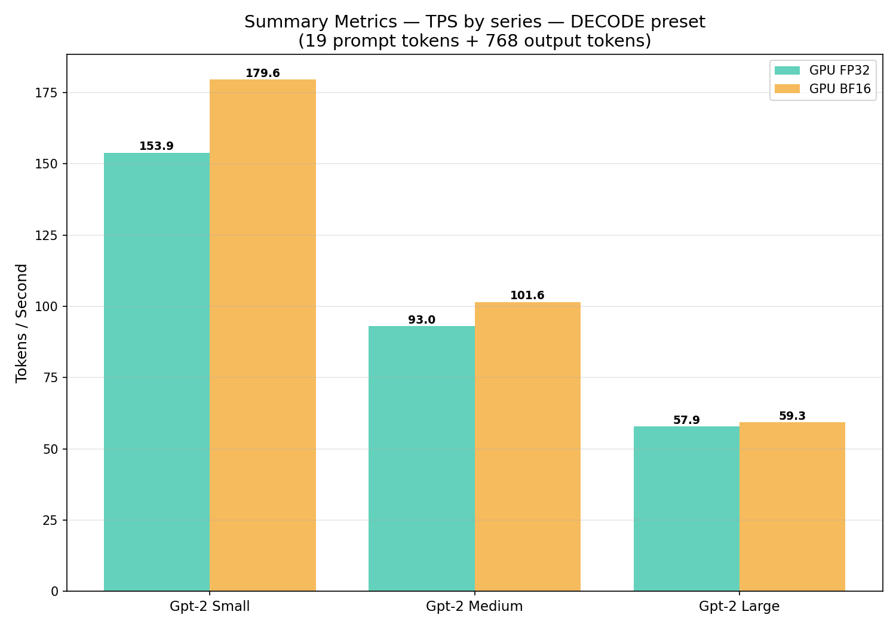
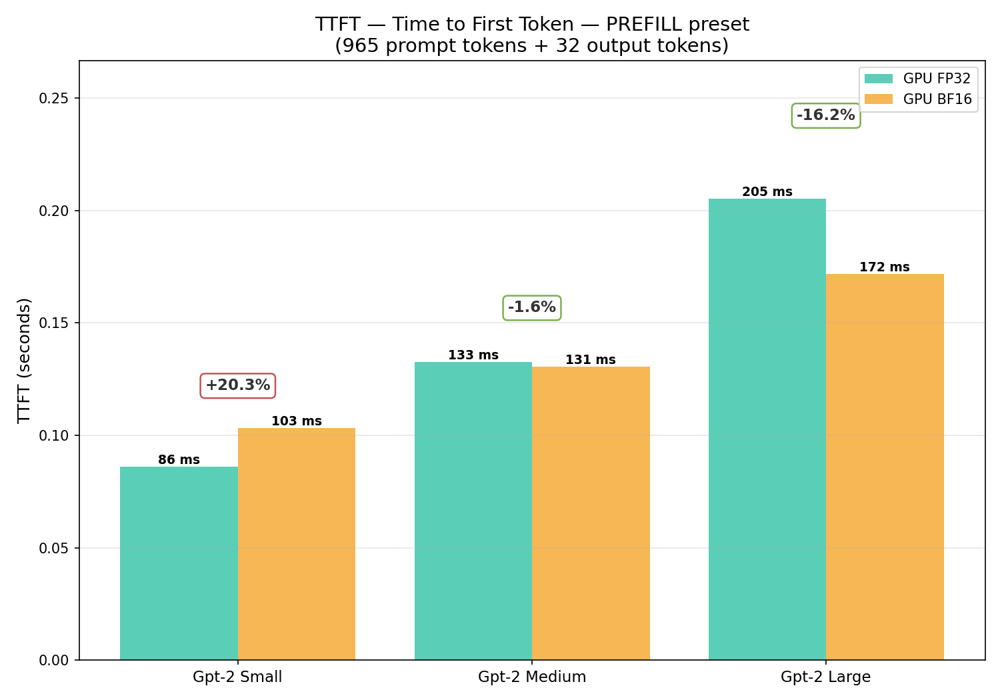
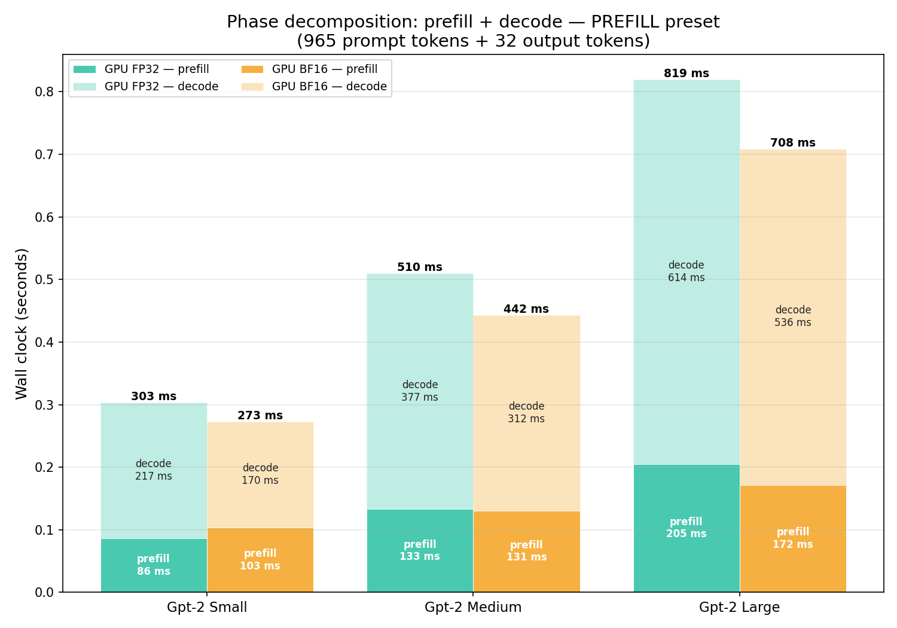
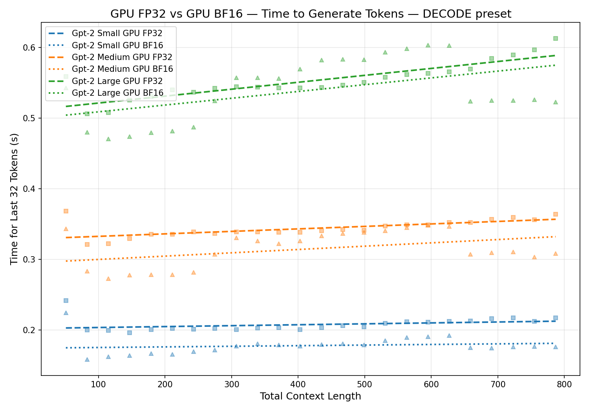
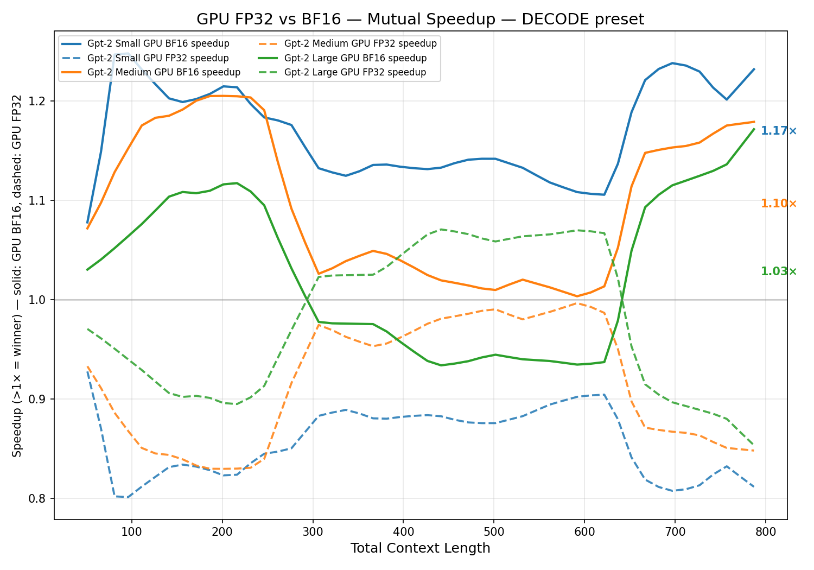

# GPT-2 in C — FP32 to BF16 on GPU

_The fourth article in the series: from CPU baseline, to CPU with KV cache, to GPU, to BF16._

## Intro

In the previous article I moved GPT-2 inference from CPU to GPU and ended with three FP32 numbers on an RTX 5080: **158 / 95 / 60 TPS** for Small / Medium / Large. The bandwidth analysis in that article pointed at the obvious next step: drop precision from FP32 to BF16, halve the bytes per generated token, get most of a 2× speedup back from bandwidth alone.

Spoiler: it's more complicated than that. The implementation worked end-to-end, the model produces fluent BF16 output, and on GPU the build matrix grew to 9 binaries (CPU FP32 + GPU FP32 + GPU BF16 across three model sizes). But the throughput improvement on Large turned out to be **~0%** — and the reasons are more interesting than the speedup would have been.

This article walks through:

1. What changed in the code to support FP32 / BF16 (and FP16, gated behind the same flag)
2. A primer on prefill vs decode, since the BF16 story differs sharply between the two
3. What we measured, what we expected, and where the expected speedup went

## Reminder — what the previous article did

The third article moved GPT-2 inference from a pure-C CPU implementation to GPU. Matrix multiplications run on cuBLAS; the rest goes through 8 hand-written CUDA kernels (`embeddings`, `layernorm`, `softmax`, `add_2d`, `add_bias`, `casual_masking`, `concat_heads`, `gelu`). KV cache stayed enabled. Tokenization stayed on CPU via a Python sidecar.

The endpoint was 60 TPS on Large with 768 generated tokens. Profiling showed cuBLAS GEMM kernels at ~77% of GPU time and `softmax_kernel` (post-rewrite) at ~16% — the shape you'd expect for a transformer where matmul should dominate.

Per-token weight bandwidth on Large in FP32 was 2.88 GiB. At RTX 5080's ~960 GB/s peak that bounds throughput at ~330 TPS. The measured 60 TPS sat at ~18% of that ceiling, so on paper there was room — and BF16 would shrink the per-token bandwidth by 2×, doubling the ceiling.

That's the version of the story the previous article ended on.

---

## Floating point format reminder

<!-- TODO: short refresher on FP32 / FP16 / BF16 layout: sign, exponent bits, mantissa bits, range vs precision tradeoff, why BF16 is the safer choice for inference. -->

---

## What changed in the code

Three places needed updates: the build system, the host-side C, and the CUDA kernels. The shape of every change is "make the storage dtype a build-time switch, keep math in FP32."

### Makefile

Two new phony targets — `bf16` and `fp16` — that inject `-DUSE_BF16` or `-DUSE_FP16` into both `gcc` and `nvcc` invocations. The default (no flag) stays FP32 and produces a binary that's bit-identical to the previous article's output. Output directories are split per dtype (`out/gpu/`, `out/gpu/bf16/`, `out/gpu/fp16/`) so a stale FP32 `.o` can't accidentally link into a BF16 host binary.

```
make gpu small               # FP32 (default)
make gpu bf16 small          # BF16
make gpu fp16 small          # FP16
```

A guard in the Makefile rejects `bf16` / `fp16` without `gpu`, since OpenBLAS has no half-precision GEMM and the CPU path would silently miscompile.

### Host-side C (`gpt2.c`)

A pair of typedefs in `model_config.h`:

```c
#if defined(USE_BF16)
    typedef __nv_bfloat16 act_t;     // for nvcc
    typedef __nv_bfloat16 weight_t;
    // ...host side uses __bf16
#elif defined(USE_FP16)
    typedef __half act_t;
    typedef __half weight_t;
#else
    typedef float act_t;
    typedef float weight_t;
#endif
```

`act_t` is for activation buffers (intermediate tensors flowing between layers); `weight_t` is for loaded model parameters. In FP32 builds both alias to `float` and the binary is unchanged. In BF16 they become 2-byte types.

Every `float`-typed buffer or pointer in the inference path was retyped to one of those two — about 320 sites across `gpt2.c` and the kernel headers. Scalar accumulators (mean, variance, softmax sum, GEMM α/β, temperature) stayed `float` so the math still happens in FP32. The GEMM call was swapped from `cublasSgemm` to `cublasGemmEx` with a build-time-selected `cudaDataType_t`:

```c
#if defined(USE_BF16)
    #define GEMM_DATA_TYPE CUDA_R_16BF
#elif defined(USE_FP16)
    #define GEMM_DATA_TYPE CUDA_R_16F
#else
    #define GEMM_DATA_TYPE CUDA_R_32F
#endif
```

The compute type stays `CUBLAS_COMPUTE_32F` in every build — FP32 accumulator regardless of input dtype.

### Loader

The on-disk format stays FP32 — there's no conversion of the `.bin` files. Instead, a new `fread_weights_or_exit` reads the file in 4 KB FP32 chunks and casts each element into the destination `weight_t` buffer:

```c
static void fread_weights_or_exit(weight_t *dest, size_t count, FILE *fp) {
#if defined(USE_BF16) || defined(USE_FP16)
    static float chunk[4096];
    while (count > 0) {
        size_t k = ...;
        fread(chunk, sizeof(float), k, fp);
        for (size_t i = 0; i < k; i++) dest[i] = (weight_t)chunk[i];
        ...
    }
#else
    fread(dest, sizeof(weight_t), count, fp);  // identical to old behavior
#endif
}
```

Same `.bin` file works for any dtype build — picked because it keeps the weight pipeline dead simple and avoids forking weight files three ways.

### CUDA kernels

A pair of `__device__ __forceinline__` helpers — `to_float(act_t)` and `to_act(float)` — that compile to identity in FP32 and to a single `__bfloat162float` / `__float2bfloat16` instruction in BF16. Every load from a global tensor is wrapped in `to_float`, every store is wrapped in `to_act`. The compute in between stays `float`:

```c
// before
output[row][i] = normalized * gamma[i] + beta[i];

// after
output[row][i] = to_act(normalized * to_float(gamma[i]) + to_float(beta[i]));
```

This pattern keeps numerical reductions (variance, exp sum) in FP32 — the only safe choice for any dtype narrower than FP32 — while letting the buffers themselves shrink to 2 bytes per element.

---

## Prefill vs decode

Generation has two phases that look very different to the GPU.

**Prefill** — the first forward pass over the input prompt. All `N` prompt tokens are processed at once. The QKV projection becomes an `N × d_model @ d_model × d_model` GEMM, with `M = N` rows. When `N` is large enough, this is a real matrix multiply — tensor cores engage, FLOPs are high, the GPU stays busy. When `N` is small, the GEMM behaves more like decode (more on this below).

**Decode** — every token after the first one. With KV cache enabled, only one new query needs to be projected per step, so `M = 1`. The GEMM becomes a vector × matrix product (a GEMV), which on cuBLAS dispatches to GEMV-shaped kernels that don't use tensor cores at all — they run on the regular FP32 ALUs.

The thing that determines whether BF16 helps is **`M` — the number of rows being multiplied**, not the phase name. Decode is always `M = 1`. Prefill is `M = N`, but on GPU there's a tile-size threshold below which cuBLAS still won't pick a tensor-core algorithm. That's the sweet-spot question and we'll measure it later in the article.

Two timings come out of the JSON log:

- **TTFT** (time to first token) — pure prefill cost. Dominated by `M = N` GEMMs.
- **TPOT** (mean time per output token) — pure decode cost. Dominated by `M = 1` GEMVs.

Output TPS as the user perceives it depends on which phase dominates. Three concrete shapes show that clearly:

| Shape | Prompt | Output | Phase mix | Real-world example |
|---|---|---|---|---|
| Prefill-dominated | 1000 tokens | 10 tokens | ~99% prefill | RAG / long-context summarization |
| Balanced | 200 tokens | 200 tokens | roughly 50/50 | Typical chat exchange |
| Decode-dominated | 10 tokens | 1000 tokens | ~99% decode | "Tell me a story…" / long generation |

A note on terminology: **prefill** and **decode** are completely standard in the inference-serving literature — the vLLM paper, NVIDIA TensorRT-LLM, Splitwise / DistServe (which actually run the two phases on *different GPU pools*), and every major serving stack use them as the canonical phase names, almost always alongside **TTFT** for prefill latency and **TPOT** / **ITL** for per-decode-step latency. **Balanced**, on the other hand, is local naming for the (~200, ~200) ISL/OSL shape — the industry usually describes workloads by their input/output sequence lengths or by use case ("chat", "RAG", "code completion") rather than a single label. I'm using the three preset names here purely because they're convenient to type in `./scripts/run.sh --decode | --prefill | --balanced`.

Whether BF16 helps depends on which of these regimes you're in — and that's where the experiment got interesting.

---

## Results

### Default sweep — same input as the previous article

First measurement: re-run the same harness used for the FP32 article (768 generated tokens after a short prompt — the decode-dominated shape) for both FP32 and BF16, all three model sizes.



| Model | FP32 TPS | BF16 TPS | Speedup |
|---|---|---|---|
| Small  | 155.0 | 184.8 | 1.19× |
| Medium |  95.6 | 103.2 | 1.08× |
| Large  |  60.1 |  60.3 | ~1.00× |

This is the **opposite** of what the bandwidth analysis predicted. Larger models stream more weight bytes per token, so they should benefit *more* from halving the dtype, not less. Yet Small saw a 19% gain, Medium 8%, and Large essentially nothing.

### First nsys investigation — the cuBLAS dispatch hypothesis

Profiling Large under both dtypes (default 768-token decode-heavy run) showed the cuBLAS GEMM time was *approximately the same* — but the kernel mix was completely different.

| Kernel family | FP32 (ms) | BF16 (ms) | Δ |
|---|---|---|---|
| `cublas gemvx` (all variants) | 3713 | 4773 | +1060 |
| `cublas gemvNSP` | 1591 | 246 | −1345 |
| `cublas splitKreduce` | 2 | 321 | +319 |
| `softmax_kernel` | 1156 | 1236 | +80 |
| `layernorm_kernel` | 224 | 206 | −18 |
| `add_bias_kernel` | 172 | 152 | −19 |
| **TOTAL kernel time** | **7208** | **7075** | **−133 (−1.8%)** |

Two things stood out:

1. **No tensor cores.** The BF16 profile showed 1.6 million invocations of `gemvx` (the GEMV kernel for `M = 1`) and only ~1600 invocations of any `cutlass_*_tensorop_*` kernel. cuBLAS at `M = 1` doesn't engage tensor cores — it picks a GEMV-shaped kernel that reads BF16 weights but multiplies on the FP32 ALUs.
2. **A new kernel appeared:** `splitKreduce_kernel` ran 720× more often in BF16 (320 ms total). cuBLAS picked a split-K decomposition for some BF16 GEMVs that needed a separate reduction pass — pure overhead that didn't exist in the FP32 path.

The hypothesis at this point: **BF16 only delivers its expected speedup when M > 1**, because that's the regime where cuBLAS actually engages tensor cores. The default test was decode-dominated (`M = 1` for ~99% of the work), so the BF16 GEMM win never materialized. Prefill — long prompt, short output — *should* tell a different story.

### Prefill sweep — testing the hypothesis

A new helper, `scripts/prefill_sweep.sh`, was added to isolate the prefill regime. It feeds prompts of increasing length and asks for **only one output token**, so `ttft_s` in the JSON log captures pure prefill time. The same article text was used as the source, sliced to approximate token counts.

| Actual tokens | FP32 TTFT | BF16 TTFT | Δ TTFT | Speedup |
|---|---|---|---|---|
|  35   | 0.0707 s | 0.0794 s | +0.0087 s | 0.89× |
| 123   | 0.0904 s | 0.0906 s | +0.0002 s | 1.00× |
| 543   | 0.1821 s | 0.2079 s | +0.0258 s | 0.88× |
| 1024  | 0.3165 s | 0.3771 s | +0.0606 s | 0.84× |

BF16 was **slower at every prompt length tested**, even at the maximum 1024-token context. The hypothesis didn't hold up.

### What the 1024-token prefill profile actually shows

The largest size was profiled with `nsys`. The result rewrote the conclusion.

| Kernel family | FP32 (ms) | BF16 (ms) | Δ | Note |
|---|---|---|---|---|
| `cutlass simt GEMM` (FP32 path) | 69.2 | 0 | −69.2 | replaced |
| `cutlass tensor-op GEMM` (BF16 path) | 0 | 22.1 | +22.1 | tensor cores engaged ✓ |
| `casual_masking_kernel` | 100.9 | **201.3** | **+100.4** | 2.00× slower |
| `concat_heads` | 31.0 | 31.0 | ~0 | unchanged |
| softmax / layernorm / add_bias / gelu | small | small | small | as expected |
| **TOTAL kernel time** | **214** | **266** | **+52** | BF16 1.24× slower |

The first two rows confirm the hypothesis was *partially* right: BF16 prefill **does** engage tensor cores. The cuBLAS GEMM kernels switched from `cutlass_*_simt_*` (no tensor cores) to `cutlass_*_tensorop_*` (BF16 tensor cores), and total GEMM time dropped from 69 ms to 22 ms — about a **3× GEMM speedup**, which is the bandwidth/tensor-core win the article had been chasing.

But a single custom kernel — `casual_masking_kernel` — went from 101 ms to 201 ms, a clean **2× slowdown in BF16**. That single kernel ate all of the GEMM savings, plus another ~50 ms on top.

The masking kernel walks the upper triangle of the attention-score matrix and writes `-INFINITY` to mask future positions. With one thread per row and a sequential loop of stores per thread, it's bandwidth-light and should be roughly equal in either dtype, or slightly faster in BF16 (half the bytes per write). Empirically it does the opposite. The most likely explanation is that the kernel is issue-bound rather than bandwidth-bound — each thread issues one store per loop iteration regardless of dtype — and the BF16 store sequence costs more than the FP32 one for this code shape. Plus the kernel runs **720 times per token** in this code: once per attention head per layer (20 heads × 36 layers), even though the same upper-triangular pattern is masked into each head's scores buffer. Most of those calls are redundant — but they all pay the BF16 penalty.

### Fixing the mask: two options on the table

Two ways to get rid of the masking penalty without giving up correctness.

**Option A — pre-init template + GEMM with `β = 1`.** Pre-initialize a static "mask template" buffer with `-INFINITY` in the upper triangle and `0` in the lower triangle. Reset `scores_h_d` from that template before each attention GEMM, then call cuBLAS with `β = 1` so the GEMM computes `α·QKᵀ + 1·C`. IEEE-754 makes `-INFINITY + finite = -INFINITY`, so the upper triangle stays masked while the lower triangle becomes the real attention score. No separate mask kernel runs. The trade-off: still one full-buffer reset per layer (the previous layer left softmax probabilities in `scores_h_d`, not the mask pattern), and `β = 1` makes cuBLAS read C in addition to writing it — one extra memory pass over scores per GEMM.

**Option B — fold the mask into `softmax_kernel`.** Drop masking at the storage level entirely. The only place that consumes the upper triangle is softmax. Add a `causal_mask` flag to `softmax_cuda`; inside the kernel, treat any column `j > row_idx` as `-INFINITY` in the max reduction and as `0` in the exp/sum reduction, never reading or writing those positions to global memory. No extra kernel call. No template buffer. No reset.

| | Pros | Cons |
|---|---|---|
| **Option A** (template + β=1) | Mask becomes data, generalizes to padding masks / sliding window. Reuses cuBLAS — no new kernel logic. | Per-layer template reset still costs the same bytes as today's mask kernel. Extra C-read on every GEMM. NaN risk if any score is ±INF (theoretical). |
| **Option B** (softmax-internal) | No extra kernel call at all. No template buffer. Smallest code change. Branch on a constant per element — predictable, no measurable cost in softmax. | Mask logic now lives inside softmax. Doesn't generalize to arbitrary masks without extra params. |

**Selected: Option B.** This codebase only ever needs a pure causal mask, the data structure for "softmax over per-token attention scores" is already its own kernel, and Option B turns out to be a strict superset: every kernel launch eliminated, and zero new buffers to manage. Option A would have been the right answer if there were any plan to support cross-attention or padding masks.

### After the fix — 1024-token prefill, re-profiled

The same nsys + comparison tool, on the same prompt, after the fold:

| Kernel family | FP32 (ms) | BF16 (ms) | Δ | Note |
|---|---|---|---|---|
| `cutlass simt GEMM` (FP32 path) | 73.2 | 0 | −73.2 | replaced |
| `cutlass tensor-op GEMM` (BF16 path) | 0 | 22.1 | +22.1 | tensor cores still engaging |
| `casual_masking_kernel` | **gone** | **gone** | — | 0 instances either way |
| `concat_heads` | 31.7 | 31.1 | −0.6 | unchanged |
| `softmax_kernel` | 5.1 | 5.3 | +0.2 | mask check is essentially free |
| layernorm / add_bias / gelu | small | small | small | unchanged |
| `cublas splitKreduce` | 1.1 | 0 | −1.1 | also gone in BF16 |
| **TOTAL kernel time** | **117** | **65** | **−52** | **BF16 1.84× faster than FP32** |

Two things to notice. First, `casual_masking_kernel` is genuinely gone — zero instances in either profile. The cost moved into `softmax_kernel`, where it added all of **0.2 ms** (5.1 → 5.3 ms). That's the column-index check inlined in the existing reduction loops, with no extra global-memory traffic.

Second, the FP32 prefill total also dropped from 214 → 117 ms. The mask kernel was 100 ms in FP32 too — it just wasn't the article's headline before because it wasn't the *delta*. The fix is a strict win in either dtype.

### After the fix — TTFT sweep

The end-to-end picture from `prefill_sweep.sh` matches the kernel-level numbers:

| Actual tokens | FP32 TTFT | BF16 TTFT | Δ TTFT | Speedup | Speedup before fix |
|---|---|---|---|---|---|
|   35 | 0.0700 s | 0.0769 s | +0.0069 s | 0.91× | 0.89× |
|  123 | 0.0900 s | 0.0854 s | −0.0046 s | 1.05× | 1.00× |
|  543 | 0.1509 s | 0.1333 s | −0.0177 s | 1.13× | 0.88× |
| **1024** | **0.2245 s** | **0.1727 s** | **−0.0519 s** | **1.30×** | 0.84× |

At 35 tokens the prompt is too short for prefill to escape kernel-launch overhead, so BF16 stays slightly behind. Everywhere else it crosses over and grows toward the predicted ceiling. **At 1024 tokens, BF16 prefill is genuinely 1.3× faster end-to-end** — the regime flip from 0.84× last week to 1.30× this week is entirely attributable to the mask fold.

### Where the sweet spot is

The same numbers, plotted as the BF16-vs-FP32 ratio against `M` (the GEMM rows), show pretty cleanly where the threshold is:

```
M (prompt tokens)         BF16 / FP32 speedup
       1   (decode)        ≈ 1.00× — no tensor cores at all
      35                   0.91× — overhead dominates, BF16 slightly slower
     123                   1.05× — tensor cores starting to engage
     543                   1.13×
    1024                   1.30× — fully in the tensor-core regime
```

The crossover from "BF16 hurts" to "BF16 helps" sits at roughly **`M ≈ 64–128`** on this hardware. Below it, tensor cores either don't engage or engage with poor utilization, and BF16 just adds the overhead of converting BF16 ↔ FP32 inside the GEMV kernel without unlocking any extra throughput. Above it, BF16 progressively wins as `M` grows.

This means the "decode problem" really is a **small-M problem** — and decode is just the extreme case where `M = 1` permanently. **A short-prompt benchmark hits this threshold in both halves**: the prefill is too small to engage tensor cores, and the decode is `M = 1` by definition. That's exactly the shape of the default `run.sh` test (13-token prompt, 768 output tokens), which is why Large still ties at ~60 TPS in the scoreboard below.

The sweet spot for BF16 to deliver its predicted speedup, end-to-end, is workloads where **most of the time is spent at `M ≳ 128`** — long-context prefill, batched inference, or speculative-decoding verification (which turns generation into multi-row GEMMs).

---

## Results — prefill across model sizes

We'll start with prefill since it's the regime where BF16 was supposed to win. Recall: prefill is the first forward pass over the prompt — all `N` tokens projected together as one `M = N` GEMM. **TTFT (time to first token)** measures pure prefill cost: the wall-clock interval from "prompt arrives" to "first output token emitted", with no decode mixed in. With M ≈ 965 we're well past the M ≳ 128 sweet-spot threshold for all three model sizes, so on paper BF16 should win across the board. The chart below shows it doesn't — the speedup grows monotonically from Small to Large, and Small actually loses to FP32.

The reproducible workload is `./scripts/run.sh --gpu --bf16 --prefill` (~965-token prompt, 32 output tokens). Two charts come out of it.

### TTFT bar chart

<!-- TODO: replace with the real plot path produced by performance_analysis.py --prefill -->


What's plotted: the prefill-only wall time (TTFT in seconds) for each `gpt2_<size>` binary, FP32 vs BF16 side by side. The colored badge above each pair is the signed percentage delta `(BF16 − FP32) / FP32`: red when BF16 is slower, green when BF16 is faster. The chart subtitle includes the actual prompt and output token counts so the workload is unambiguous.

| Model  | FP32 TTFT | BF16 TTFT | Δ                  |
|--------|-----------|-----------|--------------------|
| Small  |  86 ms    | 103 ms    | **+20.3% slower**  |
| Medium | 133 ms    | 131 ms    | −1.6%              |
| Large  | 205 ms    | 172 ms    | **−16.2% faster**  |

### Phase-decomposition chart

<!-- TODO: replace with the real plot path produced by performance_analysis.py --prefill -->


What's plotted: a stacked bar per model size split into two segments — the **prefill** share (full opacity, the TTFT) and the **decode** share (35% opacity, `TPOT × output_tokens`). Useful as a sanity check that this preset really is prefill-heavy: at 965 prompt + 32 output tokens, prefill is the larger segment for every size, and grows even more dominant on Large where each prefill GEMM has more rows of work to do per layer.

### Why the BF16 win grows from Small to Large

All three sizes share the same M (~965), all three are above the tensor-core threshold, but the result splits cleanly by parameter count. Two factors that scale with model size govern how much of the BF16 GEMM speedup actually shows up in TTFT.

**1. K and N — the GEMM's other dimensions.** Tensor cores work on 16×16×16 (or larger) tiles. Small's projections are `M × K × N = 965 × 768 × 768` (or `768 × 3072` for FFN), giving only 48 K-dimension tiles per GEMM. Large's are `M × 1280 × 1280` (or `1280 × 5120`), giving 80 tiles. Fewer tiles → less parallelism to amortize tile setup → lower achieved tensor-core FLOPs/sec. The "BF16 GEMM is 3× faster" headline from the 1024-token Large profile was measured at *Large's* dimensions; the same arithmetic at Small's dimensions delivers a smaller multiplier.

**2. Non-GEMM kernels and host overhead are a fixed cost — they don't scale with dtype.** The post-fix 1024-token Large profile (line 247) broke down as ~73 ms FP32 GEMM + ~44 ms everything else (softmax, layernorm, gelu, add_bias, concat_heads, kernel launches, tokenizer round-trip). When BF16 saved 51 ms on GEMMs, the ~44 ms "everything else" stayed put. For Small the GEMM term is roughly 12% of Large's FLOP volume, so the absolute BF16 savings shrink to a few milliseconds — while the non-GEMM fraction stays a meaningful share of TTFT. The denominator the speedup is computed against shrinks faster than the numerator.

On top of those two, BF16 has slightly higher per-call overhead than FP32: `cublasGemmEx` runs a wider heuristic search than `cublasSgemm`, and the dtype-templated CUDA kernels carry a tiny extra launch cost. On Small, where each GEMM is small to begin with, that overhead can flip a 2–3 ms savings into a net loss — which is exactly the +20% the chart shows.

Putting it in one expression:

```
BF16 prefill win  ∝  (GEMM-time fraction)  ×  (tensor-core utilization)
                            ↑                            ↑
                  grows with d_model · n_layers   grows with K, N
```

Both factors track parameter count, which is why the speedup grows monotonically: **Small (+20% slower) → Medium (~tie) → Large (−16% faster)**. The bandwidth analysis from the previous article was right *for the GEMM path* — but only at large enough K and N that the GEMM actually dominates total TTFT.

---

## Results — decode across model sizes

Decode is the second regime: every step after the first uses the KV cache, so only one new query is projected per token. Every cuBLAS GEMM is **`M = 1`** — a vector × matrix product (GEMV), which on cuBLAS dispatches to GEMV-shaped kernels that **don't engage tensor cores at all** regardless of dtype. The BF16 lever in this regime isn't compute, it's **memory bandwidth**: every GEMV reads its full weight tile from VRAM, so halving the dtype halves the bytes streamed per token.

The reproducible workload is `./scripts/run.sh --gpu --bf16 --decode` (~19-token prompt, 768 output tokens). Three charts come out of it.

### Per-token latency overlay

<!-- TODO: replace with the real plot path produced by performance_analysis.py --gpu --bf16 --decode -->


What's plotted: chunk wall time (~32 tokens per chunk) vs total context length, six lines total — three model sizes × two dtypes. The slope of each line is the per-token cost, and BF16 sits below FP32 for every model at every context length, with the gap widest on Small.

### Speedup ratio over context length

<!-- TODO: replace with the real plot path produced by performance_analysis.py --gpu --bf16 --decode -->


What's plotted: the BF16-over-FP32 speedup ratio per model size, with dotted horizontal lines at the per-model mean. Three curve features are worth calling out:

- **Mean speedup shrinks with model size** — Small ~1.20×, Medium ~1.10×, Large ~1.03×. This is the dual of the prefill picture.
- **A peak at short context (~100 tokens)** — pure GEMV territory, weight reads dominate, BF16 halves the bytes ⇒ ratio peaks.
- **A dip in the middle (~300–600), then a climb back up at long context (~700+)** — KV-cache reads grow linearly with context length, so at long context the BF16 win on the cache reads pulls the ratio back up.

### TPS summary bars

<!-- TODO: replace with the real plot path produced by performance_analysis.py --gpu --bf16 --decode -->


| Model  | FP32 TPS | BF16 TPS | Speedup           |
|--------|---------:|---------:|-------------------|
| Small  | 153.9    | 179.6    | **1.17×**         |
| Medium |  93.0    | 101.6    | 1.09×             |
| Large  |  57.9    |  59.3    | **1.02× — basically tied** |

These reproduce the article's "after mask fix" decode scoreboard within run-to-run noise (1.14× / 1.10× / 1.02×) — the mask fold doesn't touch the decode path, so the numbers shouldn't change, and they don't.

### Why the BF16 win shrinks from Small to Large — the mirror image of prefill

At decode, all three sizes are at `M = 1`, so all three are below the tensor-core threshold. The win comes purely from bandwidth halving on the per-layer GEMV. But two effects scale **with model size** in opposite directions of prefill:

**1. More cuBLAS calls per token on bigger models.** Each transformer block issues 6 GEMVs (Q, K, V, O, FFN-up, FFN-down). Small has 12 layers → 72 calls per token. Large has 36 layers → 216 calls per token. Each call carries a **fixed CPU overhead** for cuBLAS heuristic dispatch and a **fixed GPU kernel-launch overhead** that is the same in BF16 as in FP32 (and a touch higher for `cublasGemmEx` than `cublasSgemm`). For Large, those 216 fixed-cost calls per token eat a much bigger absolute chunk of the per-token budget than the bandwidth saving can recover.

**2. cuBLAS picks worse algorithms in BF16 at `M = 1`.** From the article's first nsys investigation (line 170-178): at `M = 1` BF16 cuBLAS dispatched **+1060 ms of `gemvx`** and a brand-new **+319 ms of `splitKreduce`** compared to FP32 over a full 768-token run. That's pure dispatch overhead — bytes that didn't need to be reduced, kernels that didn't need to launch — and it scales with the number of calls. Large pays that overhead 3× more often than Small per token.

Putting it next to the prefill formula to see the mirror image:

```
                        Prefill (M ≈ 965)              Decode (M = 1)
Win mechanism           tensor-core compute            memory bandwidth
What grows with size    BF16 win grows                 BF16 win shrinks
Why                     bigger K, N → better tensor-   more layers → more cuBLAS calls →
                        core utilization               more dispatch + splitKreduce overhead
Trend across S/M/L      −20% / tie / +16%              +17% / +9% / +2%
```

Same dtype change, two completely different stories. **The same cuBLAS that wins at large M with a tensor-op kernel loses at M = 1 with a worse-than-FP32 algorithm pick** — and the gap between those two regimes is exactly what the next article's `cublasLtMatmul` work targets.

---

## Scoreboard

Where things stand after the mask fix, organized by the effective `M` of the workload:

| Workload | Effective `M` | Before BF16 | First BF16 attempt | After mask fix |
|---|---|---|---|---|
| **Large `M`** — 1024-token prefill (TTFT, Large) | 1024 | n/a (FP32-only) | 0.84× — BF16 *slower* | **1.30× — BF16 faster** ✓ |
| **Large `M`** — 1024-token prefill (kernel total, Large) | 1024 | 214 ms (FP32) | 266 ms (BF16) | **65 ms (BF16) — 1.84× vs FP32** ✓ |
| **Small `M`** — default `run.sh`, Small (TPS) | 1 (decode) + ~13 (tiny prefill) | 156 | 185 (1.19×) | 178 (1.14×) |
| **Small `M`** — default `run.sh`, Medium (TPS) | 1 + ~13 | 96 | 103 (1.08×) | 104 (1.10×) |
| **Small `M`** — default `run.sh`, Large (TPS) | 1 + ~13 | 60 | 60 (1.00×) | 60 (1.02×) |

The default `run.sh` benchmark on Large remains tied — that bottleneck is cuBLAS dispatch at small `M`, not masking, and the mask fix has no effect there because (a) the decode path was already calling softmax without a mask kernel (the single new query attends to all prior cached K/V positions, no upper triangle to mask) and (b) the 13-token prefill is well below the tensor-core threshold.

---

## Lessons learned

The BF16 story for this codebase comes down to one variable — `M`, the number of GEMM rows being multiplied. After the mask fix:

- **Large `M` (≳ 128)** — long prefill, batched inference. Tensor cores engage and BF16 GEMMs run ~3× faster. With the mask kernel gone, that GEMM win shows up end-to-end: BF16 prefill is **1.3× faster on 1024-token TTFT, 1.84× faster at the kernel level**. The bandwidth analysis was right — once the right kernels were measured.
- **Small `M` (≲ 64)** — decode (always `M = 1`) and short-prefill workloads. cuBLAS doesn't engage tensor cores. BF16 input gets converted to FP32 internally and computed on the same ALUs as FP32. Heuristic dispatch makes worse choices in BF16 (more `gemvx`, plus a new `splitKreduce` reduction). Net: still ~0% on Large.

Two takeaways that generalize beyond this codebase:

1. **A bandwidth analysis tells you the right thing about the wrong kernel.** Per-token weight bandwidth predicts a 2× ceiling, and that ceiling is real for the GEMM path, but only inside the regime where tensor cores actually engage. At small `M` you're not on that diagram at all — you're paying a different cost (GEMV dispatch) that the analysis didn't model.
2. **Custom kernels can become slower in narrower dtypes if their bottleneck isn't memory.** `casual_masking_kernel` was issue-bound, not bandwidth-bound, and BF16 didn't help it. The fix wasn't to "make the kernel BF16-friendly" — it was to delete the kernel and fold its work into a kernel that was already running.

---

## Next step

The small-`M` regime is what's left, and decode is the canonical case (`M = 1`, every step, no exceptions). The bottleneck is well-understood from the first nsys profile: cuBLAS dispatches to GEMV-shaped kernels that don't use tensor cores, and in BF16 it picks even slower variants plus a `splitKreduce` reduction pass. The lever is `cublasLtMatmul` instead of `cublasGemmEx`, which lets us:

- Constrain the algorithm search via `cublasLtMatmulPreferenceSetAttribute` — workspace = 0 forces non-split-K algorithms, eliminating the `splitKreduce` overhead
- Cache the chosen algorithm per shape (decode has only ~6 unique GEMM shapes per layer), so the heuristic call doesn't re-run on every token
- Pin a tensor-op algorithm if any of them accept small `M` on Blackwell — there's no guarantee, but the LtMatmul algo enumeration exposes that information

The expected ceiling there is modest — saving the +320 ms `splitKreduce` overhead seen in the original BF16 decode profile would be roughly +5% TPS on Large. The real BF16 win at small `M` still needs a fundamentally different code structure (fused decoder kernels that don't dispatch a fresh cuBLAS call per layer per matmul, or speculative decoding which converts generation into multi-row GEMMs that *do* hit the tensor-core regime), and that's its own article.

After cublasLt, the next-tier optimizations are kernel fusion (stop round-tripping activations through VRAM between every small kernel) and weight-only int8/int4 quantization. Each of those changes the bandwidth picture again and deserves its own measurement pass.

---

## See also

- [Building GPT-2 in C — now with KV-Cache and 10x faster inference](https://rbenhayun.substack.com/p/building-gpt-2-small-in-c-a-from)
- [cuBLAS vs OpenBLAS: Benchmarking Matrix Multiply for GPT-2](https://rbenhayun.substack.com/p/2d-dot-product-using-gpu-and-cpu)
- [GPT-2 in C — now on GPU with 9× faster inference](https://rbenhayun.substack.com/p/gpt-2-in-c-now-on-gpu-with-9-faster)
- Code: [github.com/roeybenhayun/c_gpt2](https://github.com/roeybenhayun/c_gpt2)
