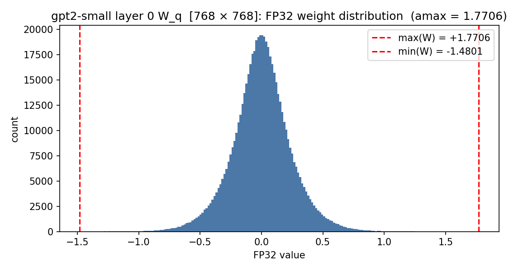
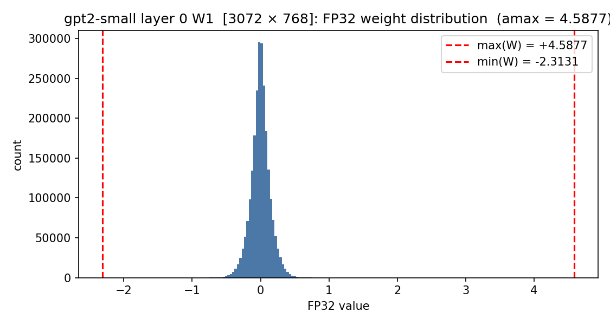
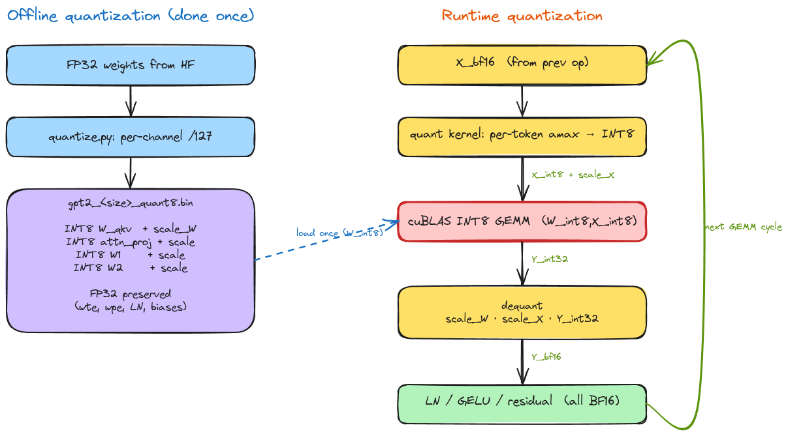
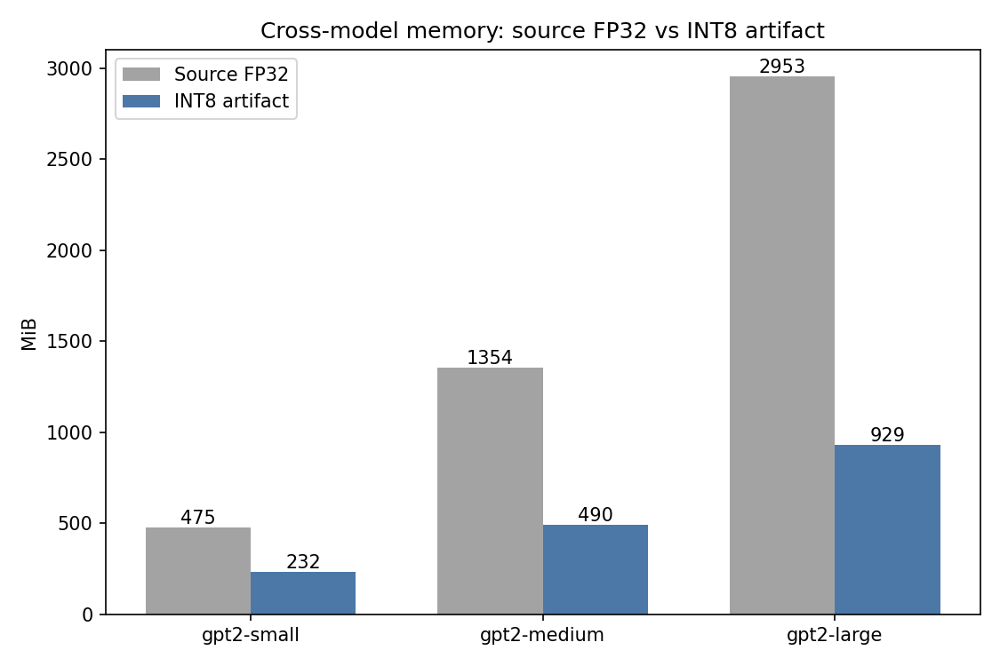
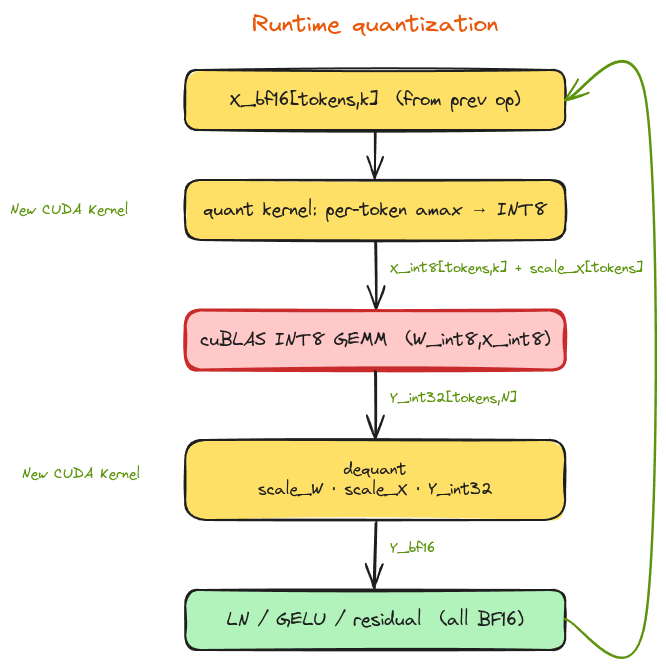

# GPT-2 in C — INT8 on GPU

_The fifth article in the series: from CPU baseline, to CPU with KV-cache, to GPU, to BF16 (cross-checked on a Lambda.ai H100 (Hopper)), to INT8 — measured on a local RTX 5080 (consumer Blackwell)._

## Intro

The previous article moved weights from FP32 to BF16 and ended on a clear takeaway: at decode (`M = 1`) the bandwidth win is small because cuBLAS picks GEMV-shaped kernels that don't engage tensor cores; at prefill the BF16 win grows with model size; and end-to-end is bound by host overhead.


This article is the next step on the same axis: drop weights from BF16 (2 bytes) to INT8 (1 byte) and run the matmuls through cuBLAS's INT8 tensor-core path (W8A8: 8-bit weights, 8-bit activations). The implementation splits into two phases — an **offline** weight quantizer (Python tool) and a **runtime** path inside `gpt2.c` (new CUDA kernels + a `cublasGemmEx` call with `CUDA_R_8I` inputs). 
On disk the weights shrink by **51% / 64% / 69%** across Small / Medium / Large. On the accuracy side, INT8 reproduces BF16 byte-identically on a meaningful fraction of greedy paper-validation cases and stays coherent on the rest.


### How this article is organized

- **Quantization basics** — the formula, a concrete FP32 → INT8 → dequant example, and why W8A8 specifically.
- **Implementation split** — offline (weights) and runtime (activations + GEMM + dequant).
- **Offline quantization** — what gets quantized, the file format, weight distribution plots, memory savings.
- **Runtime quantization** — the per-token activation kernel, the cuBLAS INT8 GEMM call, and dequant.
- **Accuracy validation** — a small paper-replication harness against the GPT-2 paper's Tables 12–17 and a BF16 ↔ INT8 byte-diff.
- **Performance** — decode TPS numbers (RTX 5080).

---

## Quantization basics

Model quantization replaces a high-precision tensor (FP32 / BF16) with a lower-precision integer tensor and a small floating-point scale, chosen so the integer × scale path approximates the original values. Main reasons it pays off on GPU:

1. **Smaller weights stream through VRAM.** At decode every GEMV reads its full weight tile per token; halving the weight dtype halves the bytes streamed.
2. **INT8 tensor cores.** Starting with Turing (SM 7.5), NVIDIA GPUs ship an INT8 tensor-core path (`IMMA`) that cuBLAS dispatches to when both GEMM inputs are `CUDA_R_8I`. Throughput per cycle is **2× the BF16 tensor-core path** on the same silicon.
3. **Smaller on-disk artifact.** The model file shrinks — useful when shipping weights through `huggingface_hub` or `setup.sh` to a fresh machine, or running on an edge device with less VRAM. 

### The formula

Per-channel symmetric quantization with FP32 scales. For an output channel $c$ of weight tensor $W \in \mathbb{R}^{n \times m}$:

$$
s_c = \frac{\max_i |W_{i,c}|}{127}, \qquad
W^{\text{int8}}_{i,c} = \text{round}\left(\frac{W_{i,c}}{s_c}\right) \in [-127, 127]
$$

Dequantization is just multiplication: $\hat W_{i,c} = s_c \cdot W^{\text{int8}}_{i,c}$. The quantization error per element is bounded by $s_c / 2$ (uniform rounding noise).

**Why `amax / 127` and not `amax / 128`?** The INT8 range is $[-128, 127]$ — 256 distinct codes. Symmetric quantization wants the two extremes of the weight distribution, $+w_{\max}$ and $-w_{\max}$, to land on equally extreme INT8 codes, so that dequantization brings them back to $\pm w_{\max}$ the same way on both sides.

Try $s = w_{\max} / 128$:
- $+w_{\max}$ would need to map to INT8 code $+128$ — but $+128$ doesn't exist in INT8 and gets clipped to $+127$. Dequantization then returns $127 \cdot (w_{\max}/128) \approx 0.992 \cdot w_{\max}$ — slightly compressed.
- $-w_{\max}$ maps cleanly to $-128$ and dequantizes back to exactly $-w_{\max}$.

After quantize → dequantize, the two extremes come back as *different values* — the positive side is slightly off, the negative side is exact. That's the asymmetric bias: a systematic error that always points the same way (positive values come back slightly smaller, negative values come back unchanged).

Try $s = w_{\max} / 127$:
- $+w_{\max}$ maps to $+127$, dequantizes back to $+w_{\max}$ exactly.
- $-w_{\max}$ maps to $-127$, dequantizes back to $-w_{\max}$ exactly.

Both extremes come back unchanged after quantize → dequantize. The cost is that the $-128$ code is never used — only 255 of the 256 codes carry data. That's a fair price for a bias-free codebook, and it's the standard convention for INT8 weight quantization across the LLM ecosystem.

### A concrete example

Take a single 7-element slice from `W_q` layer 0 of GPT-2 Small (one output channel):

```
FP32:           [ -0.4137, -0.1213, +0.0009, +0.0617, +0.1934, +0.2402, +0.4137 ]
amax        = 0.4137
scale       = 0.4137 / 127 = 0.003258
INT8:           [   -127,    -37,      0,    +19,    +59,    +74,   +127 ]
dequant:       [ -0.4137, -0.1205, +0.0000, +0.0619, +0.1922, +0.2411, +0.4137 ]
error:         [ +0.0000, -0.0008, -0.0009, +0.0002, -0.0012, +0.0009, +0.0000 ]
```

The two extremes round trip exactly (amax pins the codebook end). Values near zero round to zero (visible: `+0.0009` → INT8 `0` → dequant `0.0000`). Mid-range values pick up rounding noise of magnitude `~scale/2 ≈ 0.0016`.

The full per-tensor picture for `W_q` and `W1` (layer 0, GPT-2 Small) is plotted below.




<p align="center"><em>Figure 1 — <code>W_q</code> and <code>W1</code> weight distributions (GPT-2 Small, layer 0).</em></p>

Both tensors are Gaussians centered near zero, with asymmetric `±amax` tails.

Look closer at the `max(W)` and `min(W)` lines, though: the two extremes aren't equal in magnitude. `W_q` reaches `+1.77` on the right but only `−1.48` on the left (~16% asymmetric); `W1` is more unbalanced still, with a positive outlier at `+4.59` against only `−2.31` on the negative side. Symmetric quantization uses the larger of the two as the scale, so INT8 codes on the shorter side go unassigned — about a quarter of `W_q`'s negative codes and nearly half of `W1`'s. That's the cost of staying on the cuBLAS symmetric path.


### Why W8A8 (and not W8A16)

cuBLAS's INT8 GEMM (`cublasGemmEx` with `compute = CUBLAS_COMPUTE_32I`) requires **both** A and B (the inputs) as `CUDA_R_8I`. There is no weight-only INT8 path in cuBLAS — to keep the heavy GEMM work on cuBLAS (no custom CUDA GEMM kernel), I had to quantize activations as well. which is the W8A8 / runtime-activation-kernel work.


---

## Implementation split — offline + runtime

Two phases, talking through a paired file format on disk.



<p align="center"><em>Figure 2 — Offline vs runtime split.</em></p>

- **Offline (Python tool, runs once per checkpoint):** read FP32 weights from `weights/gpt2_<size>_c_weights.bin`, replace the four large matmul tensors per layer (`W_qkv`, `attn_proj`, `W1`, `W2`) with INT8 + per-channel FP32 scales, write a new `.bin` and `.json` metadata.
- **Runtime (C + CUDA, runs every forward pass):** for each of those four matmuls — quantize the input activations to INT8 with one scale per token, call `cublasGemmEx` with `CUDA_R_8I` × `CUDA_R_8I` → `CUDA_R_32I`, then dequantize the INT32 output back to BF16 and add the bias.

Embeddings, LayerNorm gain/bias, and matmul biases stay FP32 in the file and BF16 at runtime — quantizing them costs accuracy where it hurts most (no GEMM accumulation to average out noise) while saving only kilobytes. Sensitivity vs. savings is bad on those tensors.

---

## Offline quantization

A new tool — `tools/offline_quant/` reads the existing FP32 `.bin` file (already in the project's positional format) and produces `gpt2_<size>_quant8.bin` + `gpt2_<size>_quant8.json` per model size.

### What gets quantized

Per transformer block (and the same across all `num_layers` blocks):

| Tensor | Shape (Small) | Quantized? | Why |
|---|---|---|---|
| `W_qkv` (packed) | `[d_model, 3*d_model]` | INT8 | Large matmul input — biggest win |
| `attn_proj` | `[d_model, d_model]` | INT8 | Large matmul input |
| `W1` (FFN up) | `[d_model, d_ff]` | INT8 | The biggest matmul in the block |
| `W2` (FFN down) | `[d_ff, d_model]` | INT8 | Mirror of `W1` |
| `b_qkv`, `attn_proj_bias`, `b1`, `b2` | small vectors | FP32 | Add directly to activations — quant noise unbuffered |
| `ln1_gamma/beta`, `ln2_gamma/beta`, `lnf_gamma/beta` | `[d_model]` | FP32 | Same reason; also tiny |
| `wte`, `wpe` | `[vocab, d_model]`, `[ctx, d_model]` | FP32 | Lookups, not GEMMs — INT8 buys nothing on speed |

<p align="center"><em>Table 1 — Quantized tensors per transformer block.</em></p>

So out of ~24 tensors per layer, only **4** become INT8. The remaining tensors are byte-for-byte identical to the existing FP32 `.bin` file. The C loader's existing `fread_weights_or_exit` path (with its FP32 → BF16 cast) is reused for them unchanged; a small new `fread_int8_with_scale` helper handles the INT8 + scale blocks.

### File format

Same format as the existing FP32 `.bin`: minimal, position-based, no header. The loader reads sequentially in a fixed order and derives sizes from compile-time model config (`-DGPT2_<size>_MODEL`). The contract is byte order; the renaming convention (`_quant8.bin`) guards against feeding the wrong file to the wrong build path.

Each model produces `gpt2_<size>_quant8.json` — metadata only, the C loader does not read it. Useful for `--list`, `--stats`, audit, and the memory numbers below:

```json
{
  "model": "gpt2-large",
  "scheme": "int8_per_channel_symmetric",
  "scale_convention": "amax/127",
  "quantized_tensors": ["W_qkv", "attn_proj", "W1", "W2"],
  "memory_summary": {
    "source_fp32_total_mb": 2953,
    "quantized_int8_mb":     675,
    "preserved_fp32_mb":     253,
    "scale_overhead_kb":    1620,
    "artifact_total_mb":     929
  }
}
```

### Memory savings

| Model  | FP32 source | INT8 artifact | Saved  | Quantized (INT8) | Preserved (FP32) | Scales |
|--------|------------:|--------------:|-------:|-----------------:|-----------------:|-------:|
| Small  |     475 MB  |        232 MB |   51%  |            81 MB |           151 MB |  324 KB |
| Medium |   1 354 MB  |        490 MB |   64%  |           288 MB |           202 MB |  864 KB |
| Large  |   2 953 MB  |        929 MB |   69%  |           675 MB |           253 MB | 1620 KB |

<p align="center"><em>Table 2 — Memory savings per model size.</em></p>



<p align="center"><em>Figure 3 — Memory savings across model sizes.</em></p>

Two things to notice:

- **Savings grow with model size.** The 4 matmul tensors dominate the parameter count more in Large than in Small (deeper blocks, wider `d_model` and `d_ff`). The preserved FP32 tail (embeddings + LN + biases) is a smaller fraction of the whole.
- **Savings aren't 4×.** Naive expectation from "INT8 is ¼ the bytes of FP32" would predict the artifact at ~25% of source. The actual number is 30–50% because embeddings + biases stay FP32. The embedding tables alone are `vocab * d_model * 4 bytes ≈ 150 MB` even in Small — and they're a much larger fraction of Small than of Large.

> Memory chart produced by `uv run tools/offline_quant/quantize.py --stats --chart --out-dir docs/articles/2026-06-quant8-gpu/assets/plots/`.

---

## Runtime quantization

The four quantized matmuls per layer get a three-step replacement at runtime:



<p align="center"><em>Figure 4 — Runtime three-step replacement per quantized matmul.</em></p>

LN, GELU, softmax, residual add — all the elementwise ops between matmuls — stay BF16 exactly as in the previous article. The W8A8 path swaps only the four GEMMs per block.

### Per-token activation quant kernel

The first new kernel: read `X_bf16 [tokens, K]`, emit `X_int8 [tokens, K]` + `scale_X [tokens]`. The scale is per-token (one float per row), computed dynamically every forward pass (the same as the offline quantization calculation):

$$
\text{scale}_X[i] = \frac{\max_k |X[i, k]|}{127}, \qquad X^{\text{int8}}[i, k] = \text{round}\!\left(\frac{X[i, k]}{\text{scale}_X[i]}\right)
$$

**No calibration, no offline statistics.** Activations vary across prompts, layers, and tokens, so any offline statistic would either over-clip or under-utilize the INT8 range. Per-token dynamic quantization is the standard choice for inference and the most resilient to distribution shift.

**Kernel shape:** one CUDA block per token. Threads in a block cooperate on the `amax` reduction (warp-shuffle then shared-memory reduction across warps), then make a second pass writing INT8 values once the scale is known.


### Dequant

The third step takes `Y_int32 [tokens, N]` back to BF16 by multiplying the INT32 output by both scales — the weight per-channel scale on the column side and the activation per-token scale on the row side:

$$
Y^{\text{bf16}}[i, j] = \text{bf16}\!\bigl(s_W[j] \cdot s_X[i] \cdot Y^{\text{int32}}[i, j]\bigr)
$$

That's all the dequant kernel does. The bias add that follows it — `Y_bf16 += b` — runs through the existing `add_bias_kernel` from the previous article, unchanged. Same kernel, same launch shape, same FP32 bias buffer; nothing new on that side.

---

## Accuracy validation

The previous articles didn't have a formal accuracy harness — the tests weren't as thorough as what's here. For a precision change, that's not enough. The new harness lives under `tests/paper_validation/` and replicates a subset of Tables 12, 14, 15, 16, 17 from the GPT-2 paper (Radford et al., 2019 — *Language Models are Unsupervised Multitask Learners*).

### The challenge with paper replication

The paper prints prompts as visible chunks of the form _"… long context truncated …"_, but the model actually receives the full 384/768/1024-token context. To replicate the run I needed the *full* prompt, not the printed excerpt. Where the paper visibly published the prompt (translation, CoQA reading comprehension) I lifted it as is; where it referenced a public dataset (Tables 12 and 14) I recovered the original article and re-tokenized to the paper's context length.

For Table 14 (summarization) the source is the **`cnn_dailymail` HuggingFace dataset** — the same CNN / Daily Mail corpus the paper used per §3.6. Three of the four articles cited in Table 14 were found exactly; the fourth could only be partially recovered. For Table 12 (zero-shot conditional generation), the cited URL still resolves on the live web. Provenance and prompt-rebuild math for every case live in each `tests/paper_validation/<case>/build_info.json`.

8 of the 10 paper-validation cases run today; 2 (Tables 14a/b summarization) are temporarily disabled pending a `--prompt_file` re-enablement work item. Full layout in `tests/paper_validation/README.md`.

### Greedy vs sampled — interpreting byte-diffs

Each case has known sampling parameters from the paper:

- **Greedy cases** (`top_k = 1` or `T = 0`, six cases × three sizes): the two precisions should produce byte-identical token streams *unless quantization noise flips an argmax somewhere*. Any divergence is a real accuracy signal.
- **Sampled cases** (`top_k > 1` and `T > 0`, two cases × three sizes): the streams diverge from RNG drift after the first logit difference, so byte-equality is not expected. Check is qualitative — does the INT8 stream stay coherent?

### INT8 vs BF16 — six greedy cases × three sizes

`scripts/compare_paper_tests.sh` byte-diffs `generated_bf16_<size>.txt` against `generated_int8_<size>.txt` per case, annotated with sampling mode from each case's `metadata.json`:

| Size | Identical | ≤ 1-token diff | Mid-stream divergence (both coherent) |
|------|----------:|---------------:|--------------------------------------:|
| Small  | 1 / 6 | 1 / 6 | 4 / 6 |
| Medium | 1 / 6 | 0 / 6 | 5 / 6 |
| Large  | 2 / 6 | 1 / 6 | 3 / 6 |
| **Total** | **4 / 18** | **2 / 18** | **12 / 18** |

<p align="center"><em>Table 3 — INT8 vs BF16 accuracy on greedy paper-validation cases.</em></p>

The full per-case breakdown lives in `tests/paper_validation/int8_vs_bf16.md`. Where the two precisions diverge, both sides stay coherent — no NaN-style collapse, no broken UTF-8, no obvious INT8-only failure mode. Cases where INT8 looks qualitatively worse on one size are matched by cases where BF16 looks worse on a neighbouring size of the same prompt (e.g. `translation/t15d_fr_en_kerry`: INT8 worse at Small, BF16 worse at Medium, byte-identical at Large). That's the symmetric noise pattern expected when logit-flip drift pushes the argmax to a neighbouring high-probability token near a fragile decision boundary — not systemic INT8 degradation.


### Sampled cases — coherence check only

Across `webtext/t12_chocolate_cake` and `summarization/t14c_yemen_war` at all three sizes (six runs), every INT8 stream reads as plausible English — coherent baking instructions, plausible news summaries. The one mild concern (Medium `t14c` INT8 drifts off-topic onto unrelated wiki text after a plausible opening) is a known GPT-2 sampling failure mode, not an INT8-specific artifact.

**Verdict from the harness:** the W8A8 INT8 path is producing output of comparable quality to BF16, with the precise per-case provenance documented in the repo. Good enough to commit the runtime work and move on to performance analysis.

---

## Performance — decode TPS on RTX 5080


| Model  | FP32 TPS | BF16 TPS | INT8 TPS | INT8 vs FP32 | INT8 vs BF16 |
|--------|---------:|---------:|---------:|-------------:|-------------:|
| Small  | 153.9    | 179.6    | 179.3    | 1.17×        | 1.00×        |
| Medium |  93.0    | 101.6    |  98.5    | 1.06×        | 0.97×        |
| Large  |  57.9    |  59.3    |  57.1    | 0.99×        | 0.96×        |

<p align="center"><em>Table 4 — Decode TPS on RTX 5080.</em></p>

**Expectation from the article 4 framing.** Decode is `M = 1`, which means cuBLAS picks GEMV-shaped kernels regardless of dtype, regardless of compute type — tensor cores do not engage at `M = 1`. So the INT8 win at decode is purely **bandwidth on the GEMV weight reads** (1 byte/elem vs. 2 bytes/elem). On Large, where bandwidth is the dominant cost, that should give roughly a 1.5–2× ceiling on the GEMV portion of decode time. The end-to-end win will be smaller because of the same fixed per-token overheads — kernel-launch dispatch, the tokenizer socket round-trip, per-layer sync — that capped the BF16 gain in article 4 (the Amdahl ceiling on this codebase is ~2.24×).

For prefill (`M ≈ N` for the prompt), INT8 tensor cores **do** engage. cuBLAS dispatches to the IMMA (Integer Matrix Multiply Accumulate) path and per-call throughput should land somewhere near 2× the BF16 tensor-op kernel on the same silicon. Whether that translates to end-to-end TTFT depends on how much of TTFT is in the GEMM vs. in the non-GEMM kernels and host overhead — same analysis as article 4, different precision.

### Across all three workload presets

The same INT8 build, measured across all three workload shapes from article 4's harness (decode-dominated, prefill-dominated, balanced):

| Model  | Decode TPS | Prefill TTFT | Prefill TPS | Balanced TPS |
|--------|-----------:|-------------:|------------:|-------------:|
| Small  |     179.3  |     94.5 ms  |      120.3  |       170.3  |
| Medium |      98.5  |    127.5 ms  |       71.6  |        96.7  |
| Large  |      57.1  |    166.6 ms  |       44.4  |        57.2  |

<p align="center"><em>Table 5 — INT8 across decode / prefill / balanced presets.</em></p>

The prefill TTFT numbers are the data point most worth comparing back to article 4. Against the RTX 5080 BF16 prefill TTFTs from there — Small 103 ms, Medium 131 ms, Large 172 ms — **INT8 prefill is fastest on every model size**: ~8% faster than BF16 on Small, ~3% faster on Medium and Large. That's the tensor-core engagement story working: at `M ≈ N` cuBLAS picks IMMA, INT8 throughput per cycle is the 2× edge over BF16 the spec promises, and a small but consistent fraction of that win reaches end-to-end TTFT.

---

## What's next

INT8 is the last precision lever the cuBLAS-based inference path has left to pull. The next big milestone for this codebase isn't another inference optimization — it's **training GPT-2 from scratch in C / CUDA**: forward pass + backward pass + optimizer state, on the same hand-written kernels and the same loader format that the inference path uses today.

Two adjacent directions worth flagging without committing to:

- **Make the model more chat-like.** Vanilla GPT-2 is a base language model — fluent but not instruction-following. Whether a small SFT / fine-tune pass on a chat dataset is feasible inside this codebase (or whether it's cleaner to do the fine-tune in PyTorch and re-export weights into the existing `.bin` format) is an open question.

---

## See also

- [Building GPT-2 in C — now with KV-Cache and 10× faster inference](https://rbenhayun.substack.com/p/building-gpt-2-small-in-c-a-from)
- [cuBLAS vs OpenBLAS: Benchmarking Matrix Multiply for GPT-2](https://rbenhayun.substack.com/p/2d-dot-product-using-gpu-and-cpu)
- [GPT-2 in C — now on GPU with 9× faster inference](https://rbenhayun.substack.com/p/gpt-2-in-c-now-on-gpu-with-9-faster)
- [GPT-2 in C — FP32 to BF16 on GPU](https://rbenhayun.substack.com/p/gpt-2-in-c-fp32-to-bf16-on-gpu) <!-- [Roey] update URL when published -->
