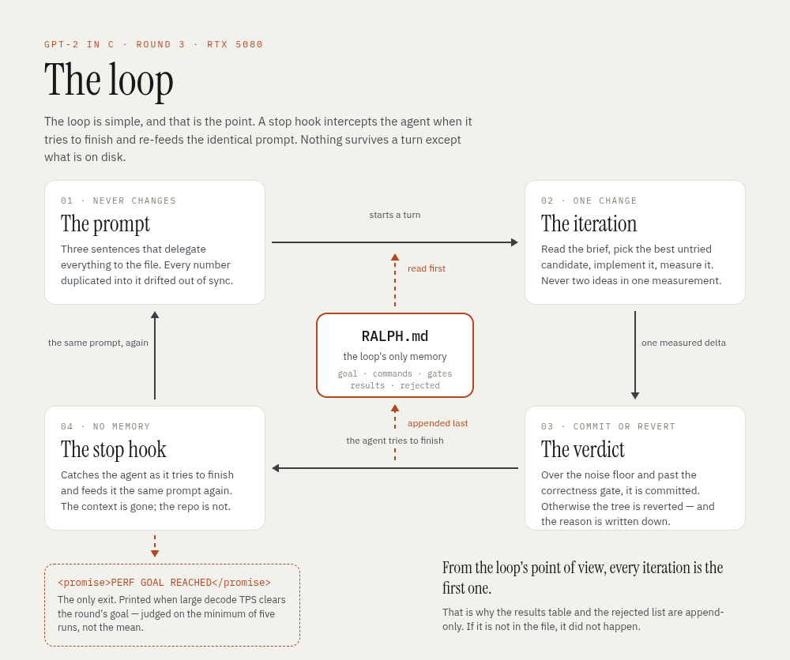
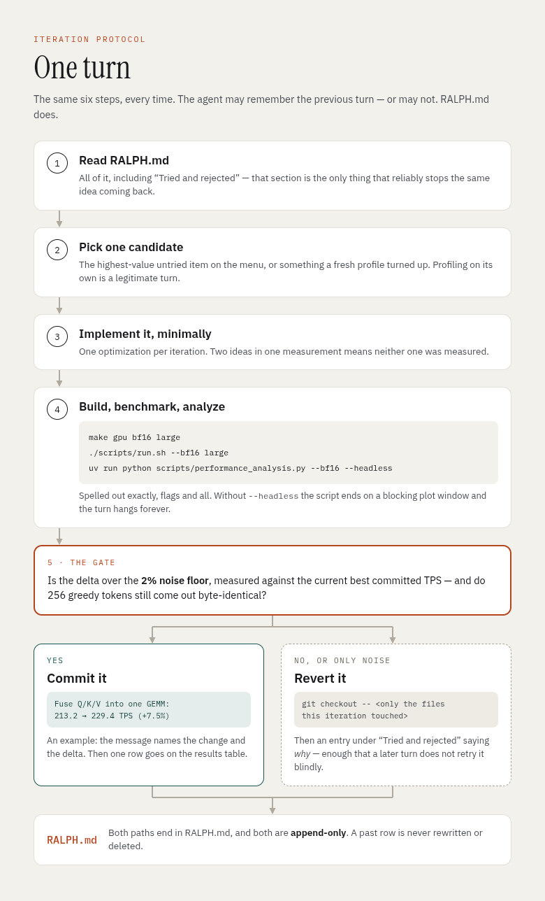
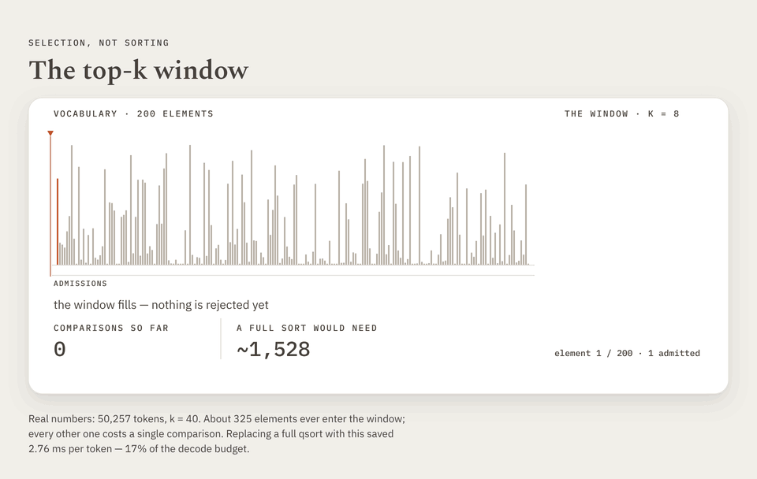
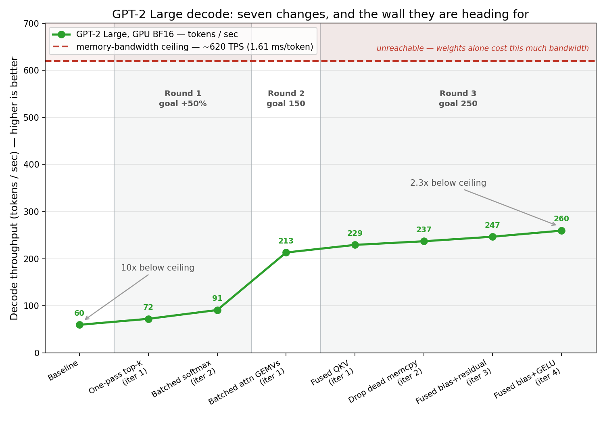

# GPT-2 in C — 4.3× faster decode, found by a Ralph loop in Claude Code

_The sixth article in the series: from CPU baseline, to KV-cache, to GPU, to BF16, to INT8 — and now a performance round where the optimizations were found by Claude Code running in a Ralph loop. Measured on a local RTX 5080._

## Intro

The previous five articles were hand-written optimization work: KV-cache, cuBLAS, BF16, INT8. This one is different. I gave [Claude Code](https://claude.com/claude-code) a goal — *make GPT-2 Large BF16 decode 50% faster* — and ran it under the **Ralph Loop plugin**, which installs a stop hook that re-feeds the same prompt every time the agent tries to finish. The agent keeps iterating against its own committed work until the goal is met. The loop itself is simple; what it buys is persistence.

Three rounds later, decode throughput on GPT-2 Large had gone from **59.8 to 259.7 tokens/sec — 4.3×** — across seven accepted changes.

Of the seven optimizations the LLM found: **not one of them was arithmetic.** No hand-written GEMM, no new matmul kernel, no algorithmic change to attention. Every win was removing kernel launches, redundant trips through memory, or work that did not need doing at all.

> **Asset checklist**
> - [x] ralph_loop.png
> - [x] ralph_one_iteration.png
> - [x] top-k-window.gif
> - [ ] ralph_brief.png — not in the body; optional footer image for the post
> - [x] decode_tps_vs_ceiling.png

### How this article is organized

- **The loop** — what Ralph is, and why the brief file matters more than the prompt.
- **The results** — seven changes, round by round.
- **The pattern** — why it was all overhead, and how the bandwidth floor proved it.
- **What went wrong** — the parts worth being honest about.
- **An accuracy surprise** — INT8 got *more* accurate.

---

## The loop

The Claude Code Ralph plugin is based on Geoffrey Huntley's [Ralph Wiggum loop technique](https://ghuntley.com/ralph/): a simple development technique where an AI coding agent is repeatedly fed the exact same prompt in a fresh context window until a task is completely finished. An important caveat is that in the case of Claude Code the context window is not fresh. Therefore, depending on the domain and the goal, using this loop in Claude Code will fill the context window, which impacts the loop's ability to achieve the goal.

The only **durable** memory is therefore what is on disk: the files and the git history. Here is how the loop was wired up in Claude Code:



That is what drives the whole design. Since the prompt never changes and the context cannot be trusted to survive, every piece of state that matters has to live in a file. I kept a `RALPH.md` at the repo root holding the goal and a verified baseline, the exact build/benchmark/analyze commands, a 2% noise floor, a correctness gate — and two append-only sections: a **results table** and a list of everything **tried and rejected**.

Those last two matter most. Without them the loop re-tries an idea as soon as the context that remembered it has compacted away. A correction written into the file — a profile attribution that was off by 60%, say — is the only kind of correction that reliably survives.


## The results

Every row below came out of the same six steps, and the gate in the middle is what keeps the table honest — a change that does not clear the noise floor, or that alters 256 greedy tokens, is reverted rather than argued with.



Baseline: GPT-2 Large, BF16, GPU decode, RTX 5080 — **59.83 TPS**, 16.63 ms per token.

| # | Change | TPS | Δ |
|---|--------|-----|---|
| 1 | [`top_k_sample`: full-vocab qsort → one-pass selection](https://github.com/roeybenhayun/c_gpt2/commit/aecc951) | 72.49 | +21% |
| 2 | [Batch the decode softmax across heads](https://github.com/roeybenhayun/c_gpt2/commit/3f47f3c) | 91.19 | +26% |
| 3 | [Batch the per-head attention GEMVs](https://github.com/roeybenhayun/c_gpt2/commit/2e5c184) | 213.25 | +133% |
| 4 | [Fuse Q/K/V into one GEMM](https://github.com/roeybenhayun/c_gpt2/commit/af4ac77) | 229.43 | +7.5% |
| 5 | [Delete a dead per-layer `cudaMemcpy`](https://github.com/roeybenhayun/c_gpt2/commit/9c9250d) | 237.15 | +3.1% |
| 6 | [Fuse bias + residual at both joins](https://github.com/roeybenhayun/c_gpt2/commit/012e2e9) | 246.80 | +4.0% |
| 7 | [Fuse bias + GELU on the MLP projection](https://github.com/roeybenhayun/c_gpt2/commit/2a183a7) | 259.67 | +5.3% |

Each row links to its commit — one change, one commit, one measurement. All of them in order: [the full merge](https://github.com/roeybenhayun/c_gpt2/compare/81d7293...5ff7c0a).

Across all three sizes, and the other two dtypes:

| build | before | after | |
|---|---|---|---|
| BF16 small | 175.54 | **897.06** | 5.1× |
| BF16 medium | 98.19 | **457.48** | 4.7× |
| **BF16 large** | **59.83** | **259.67** | **4.3×** |
| FP32 large | 155.01 | 174.78 | +12.8% |
| INT8 large | 182.91 | 194.83 | +6.5% |

Three of the seven are worth describing.

### 1 · The qsort — 2.76 ms per token, on the CPU

Top-k sampling sorted all 50,257 `(probability, index)` pairs on the CPU every single token — through a function-pointer comparator, into a 400 KB stack array — to read off the top 40 and discard the other 50,217. Replacing it with a single pass that keeps a running top-40 cost **2.76 ms per token**, 17% of the entire token budget, spent on the CPU while the GPU idled.



_The animation uses 200 elements and k = 8 so individual bars stay legible; the real numbers are 50,257 and 40._

_Quicksort is **O(n log n)**, and the animation takes that bound literally: `n · log₂ n` = 200 × 7.64 ≈ **1,528** comparisons. Big-O drops the constant factor, so this understates the sort — average-case quicksort is closer to 1.39 · `n · log₂ n` ≈ 2,125 — which means the comparison is stacked in the sort's favour, not against it. The same bound gives ~785,000 for the real 50,257-token case._

_The small scale also understates the win: the window needs ~4.5× fewer comparisons than a sort at 200 elements, but ~14× at 50,257, because `log₂ n` keeps growing while the window stays linear._

### 2 · The softmax — 720 launches per token

Decode launched the softmax kernel once per attention head, per layer: 20 × 36 = **720 launches per token**, each doing about 2 µs of work on a single row. The heads were serialized only because they all shared one scratch row. Giving each head its own row — in a buffer that already had 1,024 of them — let all 20 go out in one launch. The kernel itself needed no modification: it was already written as one block per row.

Before — each head completes all three stages before the next one starts:

```c
for (int h = 0; h < nof_heads; h++) {
    scores  = Q_last[h] · K_cache[h]ᵀ    // GEMV
    weights = softmax(scores)            // ← one launch, per head
    context = weights · V_cache[h]       // GEMV
}
```

After — one loop becomes three passes, so the middle stage can go out in bulk:

```c
for (int h = 0; h < nof_heads; h++)
    scores[h] = Q_last[h] · K_cache[h]ᵀ        // 20 GEMV launches

weights = softmax(scores[0..nof_heads-1])      // 1 launch, all 20 heads

for (int h = 0; h < nof_heads; h++)
    context[h] = weights[h] · V_cache[h]       // 20 GEMV launches
```

Only the softmax count changes here: 720 → 36 per token. The 1,440 GEMV launches stay exactly as they were — those came down a round later, and that was the bigger win.

### 3 · The attention GEMVs — 1,440 launches per token

The same trick again, bigger. The softmax fix left a layer at 41 launches — the block above. The two GEMVs either side of it were still one-per-head: **1,440 launches per token**, each a `[1 × 64] @ [64 × n_tokens]` multiply far too small to occupy a GPU.

What unlocked them was noticing that every head runs the *identical* operation on operands at a *uniform stride*. Head `h`'s Q and K slices sit `h × head_dim` into a `d_model`-wide row, and — because of the softmax fix — its scores live in row `h` of the scratch buffer. Nothing varies between heads but a regular offset, which is exactly what `cublasGemmStridedBatchedEx` takes: one GEMM description plus "repeat it 20 times, advancing each operand by this much."

```c
scores  = batched_gemv(Q_last, K_cache, batch = nof_heads)    // 1 launch
weights = softmax(scores[0..nof_heads-1])                     // 1 launch
context = batched_gemv(weights, V_cache, batch = nof_heads)   // 1 launch
```

**Three launches per layer, down from 41.** 1,440 GEMV launches per token became 72.

It was worth +133% because it collected two costs at once. Those launches carried ~2.9 ms/token of kernel time *and* ~2.9 ms of launch gap, and removing 1,368 of them took out most of both. The second cost is the one that's easy to miss: a GEMV that narrow occupies a sliver of an 84-SM GPU, so issuing twenty back-to-back left the machine almost entirely idle, twenty times over. Batched, they run concurrently.

## The pattern

Before changing a line of code, the loop computed one number — and that number decided the direction of everything after.

GPT-2 Large reads about **1.54 GB of weights per token** at BF16. The RTX 5080 has roughly **960 GB/s**. So the hard floor is **~1.61 ms/token ≈ 620 TPS**.

The baseline was 16.63 ms — **10× above the floor.** That single number said decode was *not* memory bound, which is the default assumption for LLM inference and would have sent the work straight at the GEMMs. It was wrong here, and the profile confirmed why: cuBLAS was already achieving **78–83% of peak bandwidth** on the MLP and lm_head matrices. There was nothing to win there.

What there was instead: ~2,100 kernel launches per token, and at one point **44% of the token was not kernel execution at all** — just gaps between launches.

Seven changes later the token is 3.76 ms, **2.3× above the floor** instead of 10×.



_Shaded bands are the three loop runs; each was a separate Ralph session with
its own goal, its own verified baseline and its own exit. Round 2 met its target
in a single iteration — and that one change, batching the per-head attention
GEMVs, is two thirds of the entire gain. The curve flattens hard after it. The
dashed line is the physics: 1.54 GB of weights per token at ~960 GB/s._

> If you take one thing from this: compute the bandwidth floor *before* optimizing. It tells you whether you are fighting physics or fighting overhead, and those need completely different work.

## What went wrong

A clean 4.3× makes the process sound smoother than it was.

**Its own ranking was wrong.** Going into the final round, CUDA graph capture was ranked the top candidate — it targeted a measured 1.24 ms launch gap. It was never implemented. Reading the code turned up a blocker nothing in the analysis had anticipated: every kernel in the project launches on the **default stream**, and the legacy default stream cannot be stream-captured. Graphs are gated behind a repo-wide refactor. Four other changes delivered the round instead.

**A profile was read wrong by 60%.** One round credited the per-head attention GEMVs with 1.78 ms, taken from the two cuBLAS entries at the top of the profile. The work was actually spread across **six** entries totalling ~2.9 ms, because cuBLAS dispatches different internal kernels for different matrix shapes and the profiler lists each separately. The lesson is narrower than "profile more": sum the entries belonging to one *logical operation*, rather than reading the top few rows. Getting it wrong meant the change was predicted at half its true value — and the correction only stuck because it was written into the brief, where the next round would read it.

**Measurement variance nearly caused a false claim.** At 4 ms per token, run-to-run spread reached ~2.3% — up from under 0.5% at the start, because fixed per-run costs are a bigger fraction of a smaller number. Near a threshold, the mean is not good enough. The final goal was called on the **minimum** of five runs.

**Nothing was ever rejected.** Across three rounds and seven accepted changes, the "Tried and rejected" section of `RALPH.md` stayed empty. Not one attempted optimization failed its gate and had to be reverted. That reads well, but it is the statistic a sceptical reader should circle, because it has two explanations and I cannot fully separate them: either the candidate menu was good enough that every pick was sound, or the loop only ever attempted changes it was already confident about and never explored anything risky. A 7-for-7 hit rate is not obviously the sign of a bold optimizer.

## An accuracy surprise

Three of the final round's changes were not dtype-guarded, so FP32 and INT8 went through the new kernels too. Re-measuring both: no regression, both faster.

But INT8's greedy output **changed**, which is a red flag — greedy decoding is argmax, and argmax is normally robust to last-bit rounding.

It turned out to be an improvement. Measured against the high-precision BF16 reference output:

| INT8 build | agrees with BF16 for |
|---|---|
| before | **52 characters** |
| after | **996 characters** (the whole sample) |

The fused kernels compute `x + bias + residual` in float and round **once**. The unfused pair rounded to the storage dtype, wrote to memory, read it back, and rounded **again**. One rounding instead of two matters most where the activation error is already largest — which is exactly INT8.

The lesson generalizes: a fused kernel is not numerically neutral, and "the output changed" should be judged against the most accurate reference you have, not against the previous build of the same dtype.

## Where else this might fit

What made the loop work here is that performance optimization comes with its own scoreboard: a number to move, a verified baseline, and a correctness gate that makes a bad change obvious within a single measurement. I am curious which other domains have that shape — anything with a metric worth moving and a cheap way to check it — and whether they would run better through the Claude Code plugin or in Huntley's original fresh-context form.

## See also

- [GPT-2 in C — INT8 on GPU](../2026-06-quant8-gpu/article.md)
- [GPT-2 in C — FP32 to BF16 on GPU](../2026-05-fp32-to-bf16-gpu/article.md)
- [GPT-2 in C — now on GPU with 9× faster inference](../2026-04-gpu-inference/article.md)
- [Ralph Wiggum as a software engineer](https://ghuntley.com/ralph/) — the original technique
